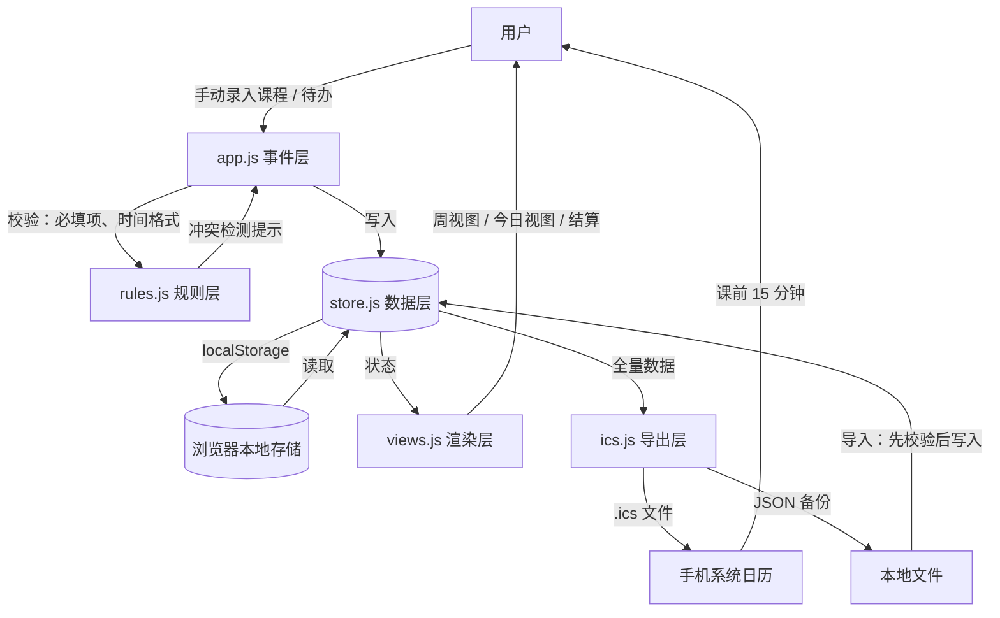

# TECH_DESIGN.md — 大学生日程助手 · 一期技术设计

> 版本：v1.0 ｜ 日期：2026-09-20 ｜ 阶段：Day 5 技术设计
> 输入文档：`PRD.md`（一期功能与验收标准）、`大学生日程助手-设计方案.md` v1.1（数据模型与分期）、`research.md`（规则优先原则）
> 本文档只定义一期范围内**怎么搭**，不重复定义**做什么**（那是 PRD 的职责）。

---

## 一、技术路线（含选型理由）

### 1.1 候选路线比较

| 维度 | A 原生 Web（HTML/CSS/JS）✅ 选定 | B Vue 3 + Vite | C React / Next.js |
|---|---|---|---|
| 学习成本 | **低**：无 npm、无构建、无配置文件，代码即所见 | 中：需学 .vue 单文件组件、构建命令、npm 报错 | 高：JSX、hooks、状态管理，Next.js 另需理解服务端渲染 |
| 线上持久化 | **静态文件直接托管，零配置** | 构建产物托管，需配 base 路径 | 可托管，但 Next 默认依赖 Node 运行环境 |
| 费用 | **0**（GitHub Pages 免费） | 0 | 0（Vercel 免费档，国内访问稳定性一般） |
| 排错难度 | **最低**：浏览器报错行号 = 源文件行号 | 中：浏览器运行的是构建产物，依赖 sourcemap 回溯 | 中高：同上，且调用链更长 |
| 主要代价 | 代码量变大后需自觉分层（用文件拆分 + 全局命名空间约束） | 多一层工具链，对零基础是额外认知负担 | 收益在本期为零 |

**选定：路线 A（原生 Web）+ localStorage。**

**理由（四条）**：
1. **每一步可见**。零构建意味着改完刷新即见效，出问题时能亲眼定位——对当前阶段最有价值。
2. **排错成本最低**。构建工具会在源码与运行代码之间加一层，而本项目复杂度（周视图 + 打勾 + 导出）不需要框架。
3. **PRD 的功能不需要响应式框架**。一期只有一张周表和一个列表，整表重渲染的开销可以忽略。
4. **将来迁移成本可控**。等代码量真的撑不住时，数据模型与业务规则已稳定，换框架只是换渲染层；反过来（先上重工具再减负）才难。

### 1.2 存储方案比较

| 维度 | localStorage ✅ 选定 | IndexedDB |
|---|---|---|
| 学习成本 | **低**：键值对 + JSON 序列化，两行代码存取 | 高：异步 API、事务、对象仓概念 |
| 容量 | 约 5MB——本项目几十条日程不足 100KB，余量数十倍 | 大得多，本项目用不上 |
| 排错 | **直观**：F12 → Application → Local Storage 能直接看见存了什么 | 需翻对象仓，不直观 |
| 风险 | 清除浏览器数据会丢失 → **对策：JSON 导出/导入兜底（PRD F9）** | 同样会丢失 |

### 1.3 一个必须遵守的工程约定

**不使用 ES Module（`<script type="module">`）。** 原因：`file://` 协议下浏览器会拦截模块加载，导致本地双击 `index.html` 直接白屏。一期改用普通 `<script>` 标签按顺序加载，各文件挂到全局命名空间（`Store` / `Rules` / `Views` / `Ics`）上共享——**保住「双击就能用」这个体验**，也便于你直接看懂加载顺序。

---

## 二、项目结构

```
vibe-coding-project/
├─ index.html                    # 唯一页面：视图容器 + 弹窗骨架
├─ css/
│  └─ style.css                  # 全部样式（含移动端/桌面端媒体查询）
├─ js/                           # 按职责分层，加载顺序即依赖顺序
│  ├─ store.js                   # 数据层：localStorage 唯一出入口
│  ├─ rules.js                   # 规则层：周次换算、单双周、冲突检测、今日统计
│  ├─ ics.js                     # 导出层：.ics 生成、JSON 导入/导出
│  ├─ views.js                   # 渲染层：周视图、今日视图、结算条
│  └─ app.js                     # 入口：事件绑定、增删改流程编排
├─ AGENTS.md                     # 项目规则（Day 1）
├─ PRD.md                        # 产品需求（Day 4）
├─ research.md                   # 需求研究（Day 3）
├─ 大学生日程助手-设计方案.md      # 产品方案 v1.1（权威）
└─ .gitignore                    # 敏感文件保护清单（Day 2）
```

**分层原则（与「规则优先，AI 兜底」对应）**：`store.js` 是数据进出的唯一闸门，`rules.js` 只做纯计算（不碰 DOM、不碰存储），`views.js` 只负责把数据画出来。这样将来接云同步或 AI，只需改一处。

**将来新增文件的位置约定**：AI 相关代码进 `js/ai/`，页面拆分成多视图时进 `js/views/`——现在不建，只约定。

---

## 三、数据对象及字段

存储键命名：`sched.v1.<表名>`。数据模型沿用设计方案第三节，只落地一期所需字段。

### 3.1 `sched.v1.semesters`（学期）

| 字段 | 类型 | 必填 | 说明 |
|---|---|---|---|
| id | string | ✅ | 唯一标识（`sem_` + 时间戳） |
| name | string | ✅ | 学期名，如「2026 秋」 |
| first_monday | string `YYYY-MM-DD` | ✅ | 第一周周一日期——**周次换算的锚点** |
| total_weeks | number | ✅ | 总周数，如 18 |
| periods | array | ⬜ | 各节次的起止时间表（**Day 8 新增**），形态与约定见下方说明；不填则回落到默认 10 节模板 |
| created_at | string ISO | ✅ | 创建时间 |

**`periods` 的存储形态（Day 8 增补）**

```json
"periods": [
  { "no": 1, "start": "08:00", "end": "08:45" },
  { "no": 2, "start": "08:55", "end": "09:40" }
]
```

- `no`：节次序号，整数 **1–15** 且不重复；`start` / `end`：`HH:mm`，`end` 必须晚于 `start`
- 为什么做成数组而不是写死：**各校各专业的上课节次时间不同**（有的 45 分钟一节、有的 50 分钟，午休长短也不一样），所以它是"可编辑的模板"而非常量
- 允许空数组（`[]`）＝ 用户表示"不设置节次"；界面渲染时按 `Store.defaultPeriods()` 的默认 10 节显示
- 编辑入口两处：初始设定页（`su-periods`）与学期设置弹窗（`f-periods`），共用 `views.js` 的 `periodsEditor()`
- **当前状态（如实记录）**：`periods` 到 Day 8 为止**只有"存"和"改"，还没有"用"** ——课程卡片显示的仍是课程自己的 `start_time`（绝对时间），周视图也还没画节次时间轴。接上消费者（如周视图左侧按 `periods` 画时间轴、添加课程时从节次下拉反推时间）属于后续工作，届时本字段才真正生效

### 3.2 `sched.v1.schedules`（日程：课程 + 独立日程）

| 字段 | 类型 | 必填 | 说明 |
|---|---|---|---|
| id | string | ✅ | 唯一标识（`sch_` + 时间戳 + 随机位） |
| type | `course` \| `event` | ✅ | 课程 / 独立日程（一期只开放这两种） |
| title | string | ✅ | 日程名称（课程名 / 事件名） |
| note | string | ⬜ | 备注（PRD 要求字段） |
| location | string | ⬜ | 教室 / 地点（课程常用） |
| weekday | number 1–7 | course ✅ | 1=周一 … 7=周日 |
| start_time | string `HH:mm` | ✅ | 开始时间 |
| duration | number（分钟） | ✅ | 持续时长 |
| week_rule | `every` \| `odd` \| `even` | course ✅ | 每周 / 单周 / 双周（一期仅三档） |
| date | string `YYYY-MM-DD` | event ✅ | 独立日程的具体日期（一次性） |
| color | string | ⬜ | 视觉标识色 |
| semester_id | string | course ✅ | 所属学期 |
| manual_edited | boolean | ✅ | 手动改过则重新导入时不覆盖（为后续 AI 识别预留） |
| created_at / updated_at | string ISO | ✅ | 时间戳 |

### 3.3 `sched.v1.todos`（待办）

| 字段 | 类型 | 必填 | 说明 |
|---|---|---|---|
| id | string | ✅ | 唯一标识（`todo_` + 时间戳） |
| title | string | ✅ | 标题 |
| note | string | ⬜ | 备注 |
| due_date | string `YYYY-MM-DD` | ✅ | 截止日期（决定它出现在哪一天） |
| done | boolean | ✅ | 是否完成（PRD F6 打勾） |
| done_at | string ISO | ⬜ | 完成时间（供后续复盘用） |
| source | `manual` \| `lecture` \| `review` | ✅ | 来源，一期固定 `manual`，为二期预留 |
| created_at | string ISO | ✅ | 创建时间 |

### 3.4 `sched.v1.meta`（元信息）

| 字段 | 类型 | 说明 |
|---|---|---|
| schema_version | number | 数据结构版本号，当前为 `1`。**将来改字段时靠它判断是否需要升级函数** |
| exported_at | string ISO | 最近一次导出时间（便于判断备份新旧） |

> 预留但一期不使用的表：`habits_records`（三期）、`lectures`（二期）、`reviews`（五期）。数据模型已按方案建全，此处不实现。

---

## 四、API 列表

> **一期没有后端，因此不存在 REST API。** 本节分两部分：① 前端各模块之间的内部接口（约定传什么数据）；② 用到的浏览器 API。

### 4.1 内部模块接口

**`Store`（数据层 · store.js）** — 数据进出的唯一闸门

| 方法 | 输入 | 输出 | 说明 |
|---|---|---|---|
| `Store.load()` | — | `{semester, schedules, todos, meta}` | 一次性读出全部数据；解析失败返回空结构并记录错误 |
| `Store.saveSemester(obj)` | 学期对象 | `{ok, error}` | 保存/更新学期（单学期） |
| `Store.saveSchedule(obj)` | 日程对象 | `{ok, error}` | 新增或更新（按 id 判断） |
| `Store.deleteSchedule(id)` | id | `{ok, error}` | 删除日程 |
| `Store.saveTodo(obj)` / `Store.deleteTodo(id)` | 待办对象 / id | `{ok, error}` | 待办增删改 |
| `Store.toggleTodo(id)` | id | `{ok, error}` | 切换完成状态（打勾） |
| `Store.exportAll()` | — | JSON 字符串 | 全量导出（含 meta 版本号） |
| `Store.importAll(text)` | JSON 字符串 | `{ok, error, counts}` | **先校验后写入**，校验失败不覆盖现有数据 |

**`Rules`（规则层 · rules.js）** — 纯计算，不碰 DOM 与存储

| 方法 | 输入 | 输出 |
|---|---|---|
| `Rules.currentWeekNo(semester, date)` | 学期、日期 | 当前第几周（number）；学期未开始返回 0 |
| `Rules.matchWeek(schedule, weekNo)` | 日程、周次 | 该日程本周是否发生（boolean，含单双周判断） |
| `Rules.coursesOfWeek(schedules, semester, weekNo)` | 全部日程、学期、周次 | 本周课程数组（按 weekday、start_time 排序） |
| `Rules.findConflicts(target, list)` | 待校验日程、已存在日程 | 冲突日程数组（时间区间重叠且周次相交） |
| `Rules.todaySummary(todos, date)` | 待办、日期 | `{done, total}`——**只统计待办**（PRD F7） |

**`Ics`（导出层 · ics.js）**

| 方法 | 输入 | 输出 |
|---|---|---|
| `Ics.build(schedules, semester)` | 日程、学期 | `.ics` 文本（每节课展开为独立事件，默认提前 15 分钟提醒） |
| `Ics.download(filename, text)` | 文件名、文本 | 触发浏览器下载 |

**`Views`（渲染层 · views.js）**

| 方法 | 说明 |
|---|---|
| `Views.renderWeek(state, weekNo)` | 画周网格：课程填格、待办显示在截止日对应列的待办区 |
| `Views.renderToday(state, date)` | 画今日视图 + 结算条「今日完成 N / 共 M」 |
| `Views.showConflict(list)` / `Views.toast(msg, type)` | 冲突提示 / 轻提示 |

**`App`（入口 · app.js）**：绑定按钮与表单事件，串起「取数据 → 校验 → 存数据 → 重渲染」四步。

### 4.2 用到的浏览器 API

| API | 用途 | 对应 PRD 功能 |
|---|---|---|
| `localStorage.getItem / setItem` | 读写本机数据 | F10 |
| `Blob` + `URL.createObjectURL` + `<a download>` | 生成并下载 .ics / JSON 文件 | F9 |
| `<input type="file">` + `FileReader` | 读取用户选择的 JSON 文件 | F9 导入 |
| `Date` / `Intl.DateTimeFormat` | 日期与周次计算、显示格式 | F1、F7 |
| `window.onerror` | 全局错误兜底提示（防白屏） | 错误处理 |
| （二期）`Notification` | 浏览器通知 | 本期不用 |

---

## 五、数据流

### 5.1 数据流图



若编辑器不渲染上面的图，等价的文字版：

```
                ┌─────────────── 浏览器（这台设备内）───────────────┐
用户录入 ──→ app.js ──→ rules.js（校验/冲突检测/周次计算）
                │                    │
                │                    ├─→ 冲突提示 ──→ 用户
                ↓
           store.js（唯一数据闸门）
                ↕
        localStorage（本地存储，关浏览器不丢）
                │
                ├─→ views.js ──→ 周视图 / 今日视图 / 结算 ──→ 用户看
                └─→ ics.js ──┬─→ .ics 文件 ──→ 手机系统日历 ──→ 课前 15 分钟提醒
                             └─→ JSON 文件（备份 / 换设备）
                                   ↑
                          导入：先校验 → 再写入 store.js
```

### 5.2 一句话回答「数据从哪来、到哪去」

**数据只有一个来源——你自己手动录入；只有一个落脚点——这台设备的浏览器本地存储；只有两个出口——渲染成屏幕上的视图，以及导出成系统日历（.ics）和备份文件（JSON）。** 全程不经过任何服务器。

### 5.3 数据不共享的三个边界（重要）

1. **本地 `file://` 打开 与 线上托管** = 两个不同的源 → 数据互不相通，靠 JSON 导出/导入迁移。
2. **换托管平台（如 GitHub Pages → Cloudflare Pages）= 换域名** → localStorage 按域名隔离，**数据不会自动跟随**，必须导出再导入。
3. **手机与电脑 = 两台设备** → 各自的浏览器各自存储，一期不做云同步（用户决策），迁移靠 JSON。

---

## 六、错误处理

| 场景 | 触发条件 | 处理方式 | 用户看到什么 |
|---|---|---|---|
| 数据读取失败 | localStorage 内容被破坏、JSON 解析异常 | `load()` 捕获异常 → 返回空结构；**先把损坏内容原样备份到 `sched.v1.backup`** 再继续 | 提示「数据读取异常，已备份原数据，当前显示为空」 |
| 存储写入失败 | 容量超限（`QuotaExceededError`）、隐私模式限制 | 捕获并中止写入，不改动已有数据 | 提示「保存失败，请导出备份后清理」 |
| 导入文件格式错误 | 不是 JSON、缺 `schema_version`、缺必填字段 | **校验不通过则一律不写入**，现有数据保持原样 | 提示「文件格式不正确，未做任何修改」 |
| 导入版本不兼容 | `schema_version` 高于当前程序支持 | 拒绝导入并说明版本 | 提示「该备份来自更新版本，请先升级页面」 |
| 必填项缺失 | 名称为空、时间格式不对 | 表单内标红提示，不提交 | 字段旁提示，指出哪一项不合格 |
| 时间冲突 | 新日程与已有日程重叠且周次相交 | **提示但不阻止保存**（PRD F4） | 弹提示：与哪门课冲突，可选「继续保存 / 返回修改」 |
| 学期未设置 | 未建学期就进入周视图 | 引导先完成学期设置 | 页面提示「请先设置学期开始日期」 |
| 未知运行错误 | 任意未捕获异常 | `window.onerror` 统一兜底，写一条可读提示 | 顶部提示条，页面不白屏 |

**原则**：数据安全优先——**任何可能导致数据丢失的操作，宁可不执行**；所有失败都要让用户看见原因，而不是静默失败。

---

## 七、环境变量

**一期无环境变量。** 原因：无后端、无密钥、无 AI 调用，页面是纯静态文件，没有任何需要区分配置的东西。

**将来引入时的约定（现在只写规矩，不落地）**：

| 将来场景 | 变量放哪 | 规矩 |
|---|---|---|
| AI 中转服务（如 Cloudflare Workers） | 中转服务的环境变量里 | Key 只存服务端，**绝不写进前端代码** |
| 本地开发调试 | 项目根目录 `.env.local` | 已被 `.gitignore` 第 3 行 `.env` 规则拦截，不会进仓库 |
| 前端需要区分环境 | `js/config.js` 里写常量 | 该文件只放非敏感项（如接口地址），敏感项一律不放 |

---

## 八、部署

### 8.1 选定平台：GitHub Pages

理由：仓库已在 `XingHo-VibeCoding/vibe-coding-project`，零成本、零配置、无需额外注册。

**部署步骤**：
1. 仓库 → Settings → Pages
2. Source 选 `Deploy from a branch`，Branch 选 `main`，目录选 `/ (root)`
3. 保存后等待约 1 分钟，页面变为 `https://xingho-vibecoding.github.io/vibe-coding-project/`
4. `index.html` 在仓库根目录，因此**首页无需额外配置**

### 8.2 子路径部署的硬性约定（否则上线白屏）

线上地址带子路径 `/vibe-coding-project/`，因此：

- 资源引用**必须用相对路径**：`./css/style.css`、`./js/app.js` ✅
- **禁止绝对路径**：`/css/style.css` ❌（会被解析到域名根目录，404 → 白屏）
- 页面内部跳转同理，不使用以 `/` 开头的链接

### 8.3 上线后自查清单

| 检查项 | 方法 |
|---|---|
| 页面能打开、无白屏 | 打开线上地址，F12 Console 无红色报错 |
| 资源全部加载成功 | F12 Network 无 404 |
| 数据能存住 | 添加一条课程 → 刷新页面 → 数据仍在 |
| 手机能正常访问 | 手机浏览器打开同一地址，布局正常 |

### 8.4 缓存问题

改完代码推送后若页面没变化：强刷（Windows `Ctrl + F5`、手机清除站点数据）。这是浏览器缓存，不是部署失败。

---

## 九、迁移注意事项

### 9.1 迁移到 Cloudflare Pages（你已有账号，后期可能迁）

**结论：可以迁，且不需要改代码。**

| 步骤 | 操作 |
|---|---|
| 1 | Cloudflare 控制台 → Workers & Pages → Create → Pages → Connect to Git |
| 2 | 授权 GitHub，选择仓库 `vibe-coding-project`、分支 `main` |
| 3 | **Build command 留空**（无构建步骤），**Build output directory 填 `/`** |
| 4 | Deploy，得到 `https://<项目名>.pages.dev` 地址 |
| 5 | 可选：绑定自定义域名；也可与 GitHub Pages 并存，谁好用留谁 |

**零改动的原因**：§8.2 已约定全部使用相对路径——相对路径在「带子路径」和「根路径」两种部署下都成立。这正是当初那个约定的回报。

### 9.2 ⚠️ 迁移时最容易踩的坑：数据不会跟着走

**localStorage 按「域名」隔离**，换托管平台 = 换域名 = 换了一个存储空间。**新地址打开会是空的，旧数据不会自动出现。**

**正确迁移姿势（三步）**：
1. 旧地址：点「导出 JSON」保存文件
2. 新地址：打开页面 → 点「导入 JSON」选择该文件
3. 核对：课程数量、待办、打勾状态与旧站点一致

**同理适用于**：本地 `file://` ↔ 线上托管之间互迁、手机与电脑之间互迁。**凡是换「源」的场景，都走 JSON 导出/导入。**

### 9.3 数据结构升级（`schema_version`）

将来修改字段（如加 `priority`、加 `habit` 类型）时的规矩：
1. 改代码里 `meta.schema_version` 的当前值（如 1 → 2）
2. `load()` 里加一段「版本升级函数」：读到旧版本时，为缺失字段补默认值再写入
3. **绝不静默丢弃旧字段**——数据是用户的，升级只能补不能删
4. 升级前提示用户先导出一份 JSON 备份

**实例：Day 8 新增 `semester.periods`，为什么这次没升版本号**

2026-09-23 给学期加了 `periods` 字段，但 `schema_version` **保持 `1`**。理由：这次是**新增可选字段**，旧数据在新代码下不会读出错误结果、也不会丢数据，属于兼容性扩展，不需要升级函数。

| 环节 | 旧数据（没有 `periods`）会发生什么 | 代码依据 |
|---|---|---|
| 读取 | `load()` 原样返回学期对象，`periods` 为 `undefined`，不报错 | `store.js` `load()` |
| 显示 | 渲染时判断 `Array.isArray(semester.periods)`，为空则回落到默认 10 节模板 | `views.js` `periodsEditor()` |
| 保存 | 程序性调用：不传 `periods` 就沿用旧值，旧数据存回去不会把这个字段弄丢。**但从界面点保存时一定会传**，会把页面上显示的节次固化下来（见下方补充） | `store.js` `saveSemester()`、`app.js` `collectPeriods()` |
| 导入校验 | `periods` 是可选字段，文件里没有也通过校验 | `store.js` `validateSemester()` |

**判断标准（记下来，免得下次犹豫）**：只有当**旧数据在新代码下会读出错误结果**、或**保存后丢数据**时，才必须升 `schema_version` 并写升级函数；而"多了个可选字段"不算。但**判断理由必须写在本节**，否则将来回看会疑惑当初为什么漏升。

**反过来，以下情形必须升级**：把 `periods` 从可选改成必填；改动已有字段的含义（如 `week_rule` 从三档变自定义集合）；改变字段的存储类型。

**补充：保存有两个入口，行为不一样（2026-09-23 实测后补记）**

`saveSemester()` 自己是「不传 `periods` 就沿用旧值」的宽容写法，但**界面上那两个入口一定会传**：`app.js` 在提交前用 `collectPeriods()` 从 DOM 逐行收 `[{start, end}]`（设置弹窗收 `f-periods`，初始设定页收 `su-periods`），再把结果赋给 `input.periods`。而页面上的行数＝「这个学期已存的 `periods`；没有时就是回落出来的默认 10 节」。

所以对**旧学期**点一次保存，实际效果是：**回落出来的默认 10 节被固化成了真数据**。这是「所见即所存」，不是 bug —— 屏幕上显示的就是这 10 节，存下来的自然也是这 10 节。但请记住它的两个后果：

- 固化之后就与默认模板脱钩了：以后改 `Store.defaultPeriods()` 里的作息时间，**这个学期不会跟着变**，因为它已经有了自己的 `periods`。
- 想判断某个学期固化没固化：看 `localStorage` 里 `sched.v1.semester` 的 `periods` 是 `undefined`（还没固化，走回落）还是 10 条数组（已固化）。

### 9.4 为将来接云同步预留的位置

云同步接入时，**只改 `store.js`**：把「读写 localStorage」换成「读写云端 + 本地缓存」，其余文件（rules / views / ics / app）不动。这是「数据层唯一闸门」设计的目的，也是方案二期不重构的底气。

---

## 附录：变更影响速查（余力加练）

改动方案或需求时，先查这张表，避免漏改文件。

| 若发生这种变化 | 需要改的文件 | 说明 |
|---|---|---|
| 新增/修改日程字段（如加「优先级」） | `TECH_DESIGN.md` §3 字段表 + §9.3、`store.js`（必要时写版本升级函数）、`PRD.md`（若涉及功能）、`views.js`（若需显示） | 字段变更必须同时处理老数据；先按 §9.3 判断标准定是否升 `schema_version`，**并把理由写进 §9.3** |
| 新增/修改学期字段（如 Day 8 加 `periods`） | `TECH_DESIGN.md` §3.1 + §9.3、`store.js`（`validateSemester` / `saveSemester` 兼容分支）、`大学生日程助手-设计方案.md` 第三节、`PRD.md` F1 | 同上；学期只有一条记录，用「不传就沿用旧值」保持兼容 |
| 调整一期范围（加/减功能） | `PRD.md`、`TECH_DESIGN.md`、`大学生日程助手-设计方案.md` | 三份文档必须同步，否则互相打脸 |
| 提醒提前量从 15 分钟改成其他 | `PRD.md`（F9/A9）、`ics.js` | 若已导出过 .ics，需重新导出 |
| 换前端框架 | `index.html`、`js/*`、`TECH_DESIGN.md` 第一节 | 数据模型与 rules.js 可复用 |
| 换托管平台 | `TECH_DESIGN.md` 第八、九节；**代码不用改** | 但用户需做一次 JSON 迁移 |
| 接云同步（二期） | `store.js`、`TECH_DESIGN.md`、设计方案分期章节 | 只动数据层 |
| 接 AI 课表识别（后段） | 新增 `js/ai/`、`store.js`（新增录入入口）、`.gitignore`（确认 key 不进库）、`TECH_DESIGN.md` 第七节 | 只多一个录入入口，不推翻数据模型 |
| 改规则（如周次只支持三档 → 支持自定义） | `rules.js`、`PRD.md`、`research.md`（待核实项） | 直接影响风险表里 🔴 级的课表规则解析 |
