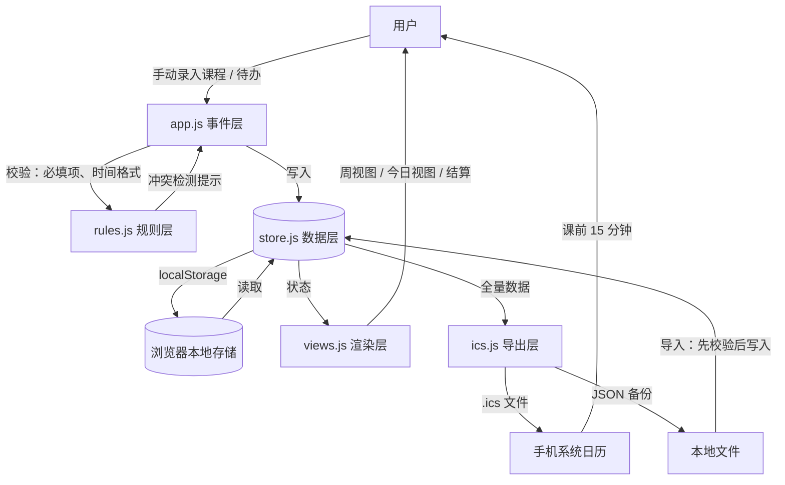

# TECH_DESIGN.md — 大学生日程助手 · 一期技术设计

> 版本：v1.2 ｜ 日期：2026-09-20（Day 5 技术设计）｜ 最近更新：2026-10-03（四期记账口径修订 + 真机三连修 + 壳版号同步）
> 输入文档：`PRD.md`（一期功能与验收标准）、`大学生日程助手-设计方案.md` v1.1（数据模型与分期）、`research.md`（规则优先原则）
> 本文档只定义一期范围内**怎么搭**，不重复定义**做什么**（那是 PRD 的职责）。
> **注意**：根目录 vanilla 实现自 Day 14 起封存；**Day 15 起正式版在 `web2/`**，其数据层与本机键约定见 §4.3（第四节其余内容是封存版的内部接口记录，仍有参考价值）。

---

## 一、技术路线（含选型理由）

### 1.1 候选路线比较

| 维度 | A 原生 Web（HTML/CSS/JS）✅ 选定 | B Vue 3 + Vite | C React / Next.js |
|---|---|---|---|
| 学习成本 | **低**：无 npm、无构建、无配置文件，代码即所见 | 中：需学 .vue 单文件组件、构建命令、npm 报错 | 高：JSX、hooks、状态管理，Next.js 另需理解服务端渲染 |
| 线上持久化 | **静态文件直接托管，零配置** | 构建产物托管，需配 base 路径 | 可托管，但 Next 默认依赖 Node 运行环境 |
| 费用 | **0**（GitHub Pages 免费） | 0 | 0（Vercel 免费档，国内访问稳定性一般） |
| 排错难度 | **最低**：浏览器报错行号 = 源文件行号 | 中：浏览器运行的是构建产物，依赖 sourcemap 回溯 | 中高：同上，且调用链更长 |
| 主要代价 | 代码量变大后需自觉分层（用文件拆分 + 全局命名空间约束） | 多一层工具链，对零基础是额外认知负担 | 收益在本期为零 |

**选定：路线 A（原生 Web）+ localStorage。**

**理由（四条）**：
1. **每一步可见**。零构建意味着改完刷新即见效，出问题时能亲眼定位——对当前阶段最有价值。
2. **排错成本最低**。构建工具会在源码与运行代码之间加一层，而本项目复杂度（周视图 + 打勾 + 导出）不需要框架。
3. **PRD 的功能不需要响应式框架**。一期只有一张周表和一个列表，整表重渲染的开销可以忽略。
4. **将来迁移成本可控**。等代码量真的撑不住时，数据模型与业务规则已稳定，换框架只是换渲染层；反过来（先上重工具再减负）才难。

### 1.2 存储方案比较

| 维度 | localStorage ✅ 选定 | IndexedDB |
|---|---|---|
| 学习成本 | **低**：键值对 + JSON 序列化，两行代码存取 | 高：异步 API、事务、对象仓概念 |
| 容量 | 约 5MB——本项目几十条日程不足 100KB，余量数十倍 | 大得多，本项目用不上 |
| 排错 | **直观**：F12 → Application → Local Storage 能直接看见存了什么 | 需翻对象仓，不直观 |
| 风险 | 清除浏览器数据会丢失 → **对策：JSON 导出/导入兜底（PRD F9）** | 同样会丢失 |

### 1.3 一个必须遵守的工程约定

**不使用 ES Module（`<script type="module">`）。** 原因：`file://` 协议下浏览器会拦截模块加载，导致本地双击 `index.html` 直接白屏。一期改用普通 `<script>` 标签按顺序加载，各文件挂到全局命名空间（`Store` / `Rules` / `Views` / `Ics`）上共享——**保住「双击就能用」这个体验**，也便于你直接看懂加载顺序。

---

## 二、项目结构

```
vibe-coding-project/
├─ index.html                    # 唯一页面：视图容器 + 弹窗骨架
├─ css/
│  └─ style.css                  # 全部样式（含移动端/桌面端媒体查询）
├─ js/                           # 按职责分层，加载顺序即依赖顺序
│  ├─ store.js                   # 数据层：localStorage 唯一出入口
│  ├─ rules.js                   # 规则层：周次换算、单双周、冲突检测、今日统计
│  ├─ ics.js                     # 导出层：.ics 生成、JSON 导入/导出
│  ├─ views.js                   # 渲染层：周视图、今日视图、结算条
│  └─ app.js                     # 入口：事件绑定、增删改流程编排
├─ AGENTS.md                     # 项目规则（Day 1）
├─ PRD.md                        # 产品需求（Day 4）
├─ research.md                   # 需求研究（Day 3）
├─ 大学生日程助手-设计方案.md      # 产品方案 v1.1（权威）
└─ .gitignore                    # 敏感文件保护清单（Day 2）
```

**分层原则（与「规则优先，AI 兜底」对应）**：`store.js` 是数据进出的唯一闸门，`rules.js` 只做纯计算（不碰 DOM、不碰存储），`views.js` 只负责把数据画出来。这样将来接云同步或 AI，只需改一处。

**将来新增文件的位置约定**：AI 相关代码进 `js/ai/`，页面拆分成多视图时进 `js/views/`——现在不建，只约定。

### 2.1 前端设计约定（Day 9 前端审查后固化）

审查依据：`emilkowalski/skills` 的 `mobile-native` 与 `emil-design-eng` 两个 skill，加上 WCAG 对比度计算。

| 约定 | 值 | 为什么 |
|---|---|---|
| 触摸设备输入框字号 | **≥16px**（`@media (pointer: coarse)`） | iOS 聚焦 <16px 的输入框会自动放大页面且不缩回，整页布局歪掉 |
| 所有 `:hover` | 必须包在 `@media (hover: hover) and (pointer: fine)` 内 | 触摸屏会被浏览器伪造 hover，点完颜色卡住不恢复 |
| 可点元素按下反馈 | `:active { transform: scale(0.97) }` + `transition` 100–160ms `ease-out` | 手指落下的瞬间就要有回应，否则「点了没反应」 |
| 文字对比度 | 正文 ≥ **4.5:1**，弱化文字用 `--c-faint`（4.83:1） | 原「无课」用 `#c3c8cf` 只有 1.68:1，等于看不见 |
| 最小字号 | **11px**（10px 已在 Day 9 全部上调） | 手机上 10px 要凑近才看得清 |
| 底部固定区域 | 必须加 `env(safe-area-inset-bottom)`；`index.html` 的 viewport 需带 `viewport-fit=cover` | 否则在带 home 指示条的设备上被压住 |
| 触屏交互基线 | `-webkit-tap-highlight-color: transparent`、`touch-action: manipulation`、外壳 `overscroll-behavior: none` | 去掉「这是网站」的三处典型信号 |
| 媒体查询顺序 | **能力类**（`pointer`/`hover`）放文件末尾；**版面类**（`max-width`）必须排在它要覆盖的规则之后 | 同优先级下靠书写顺序决定胜负，顺序错了覆盖就失效 |

> 检查脚本：`.workbuddy/tmp/css-audit.js`（35 项，含括号配平、断裂选择器、hover 门控、对比度实算、最小字号、媒体查询顺序、字号/字重令牌体系）。
> 故障注入自证：`.workbuddy/tmp/inject-type2.js`（6 条注入必须全部报红，验证检查真的有检出力）。

### 2.2 字号与字重令牌（Day 9 第二轮审查，字体/信息层级）

审查依据：SkillHub 安装的 `ui-typography`（源自 Matthew Butterick《Practical Typography》）与 `typography`（含 CJK 专属规则）。**中文字距/行宽按中文口径取，不照搬西文数值。**

**核心结论**：原先把「层级」全压给字号，导致 11 级字号里有 5 级挤在 15/14/13/12.5/12 的窄区间（17→16→15 只差 1px，人眼无感）。规则给的解法相反——**先加字重，字号级数能砍一半**。

| 令牌 | 值 | 用途 |
|---|---|---|
| `--t-display` | 30px | 时间面板滚动大数字（全站唯一） |
| `--t-h1` | 20px | 页面主标题 |
| `--t-h2` | 17px | 区块标题（顶栏、错误页） |
| `--t-h3` | 15px | 小节标题、表单标题、弹窗标题 |
| `--t-body` | **14px** | **正文基准**（按钮/输入框/标签页/课程名） |
| `--t-small` | 13px | 次要文字（字段标签、说明、元信息） |
| `--t-caption` | 12px | 最小可用（错误提示、节次轴、角标） |
| `--w-body` / `--w-label` / `--w-strong` / `--w-title` | 400 / **500** / 600 / 700 | 正文 / 标签 / 小标题 / 主标题 |
| `--lh-tight` / `--lh-body` | 1.2 / 1.5 | 标题 / 正文（**必须无单位**） |

约束（已写进检查脚本，违反即报红）：

- **字号一律写 `var(--t-*)`，不写裸 px**。唯一例外：`@media (pointer: coarse)` 里的 `16px`，那是「防 iOS 自动缩放」的设备硬下限，不属于语义层级。
- **`line-height` 禁用 px**（不随字号缩放）。需要固定高度的表头对齐，改用 `height` + flex 居中，别用行高凑。
- **`letter-spacing` 禁用 px**，用 `em`。字号越小越需要**正**字距（把渲染糊住的字腔打开），大字反而略收。中文字距比西文敏感，幅度取西文规则的一半左右。
- **字重是层级的第一手段**：能靠 400↔500 区分开的，不要靠改字号。原来只有 400/600 两档，「次要强调」只能动字号，这是字号碎片化的根因。

> 教训（值得记住）：迁移时用「按行号替换」是脆的——加了几行注释后行号全偏。**要按「选择器 + 当前值」匹配**。此外项目文件是 **CRLF** 换行，脚本里写 `\n` 拼目标串会静默匹配不上，看着像「检查器没检出问题」，实际是注入没生效；**注入脚本必须断言「文件内容确实变了」**，否则自证会假通过。


> **Day 9 前置（2026-09-24，提前做）**：`js/ai/ai.js` 已落地（提前做 AI 课表识别模块，接入时再补第七节完整设计）。当前是**指令桩版**：
> - 分层：`Ai.recognizeRaw()`（接口层，现在是桩，返回内置样例；接真 API 只换它，key 存中转服务端）→ `Ai.parseCourses()`（解析层，纯函数：抠 JSON / 星期 / 时间 / 节次换算 / 周次规则，坏行进 `skipped` 不整体失败）→ 确认弹窗（views `aiImportModal()` + app `open-ai-import` / `ai-save`，勾选制）→ `Store.saveSchedule()`（`manual_edited:false`，重新导入可覆盖）。
> - 入口：「导出 / 备份」弹窗里的「AI 导入课表（示例）」，弹窗标题明示是样例数据。
> - `ai.js` 不碰 DOM、不碰 localStorage；候选形状与 schedules 表（type='course'）完全对齐，未改任何数据结构与存储键。
> - **重导去重**（Day 9 实测反馈）：AI 导入时同名同星期且 `manual_edited:false` 的已有课程**原地更新**（`Rules.aiDuplicateOf`，id 不变），手动建的 / 手动改过的一律不碰——这正是 `manual_edited` 字段预留的语义。

### 2.3 正式版结构与开发主线（Day 15 起）

一期在根目录的 vanilla 实现上完成验证后，**正式版界面**切换为 `web2/` 子目录下的 Vue 3 实现（原独立仓库 `vibe-coding-project-web2`，Day 15 并入本仓库）。根目录结构（见上一节）为 Day 1–14 的一期实现，**自 Day 14 起封存、不再迭代**；数据模型与业务规则口径不变（`store.js` 仍是数据唯一闸门，纯逻辑与渲染分离）。

```
vibe-coding-project/
├─ web2/                          # 正式版（Vue 3 + Vite + Tailwind 4），Day 15 起开发主线
│  ├─ index.html                  # 页面骨架（Vite 入口）
│  ├─ vite.config.js              # 构建配置（产物输出 dist/）
│  ├─ serve.js                    # 线上静态服务入口（单端口，读 PORT）
│  ├─ package.json                # 依赖与脚本（dev / build / preview）
│  ├─ src/
│  │  ├─ App.vue                  # 主壳：3 个 tab（今日/周课表/我的）+ 页面内子视图 + 引导流程 + 浮层接线
│  │  ├─ main.js                  # 挂载入口
│  │  ├─ style.css                # 全局样式与设计令牌
│  │  ├─ components/              # TimeWheel / MonthCalendar / NumberWheel / PeriodsEditor / DropdownSelect / BottomSheet（底部浮层外壳）
│  │  └─ data/                    # 数据与纯逻辑：store / periods / recognizer / summarizer / recorder / transcriber / notify / listen / listenStore / statusFrame / ics / mock
│  ├─ docs/                       # 测试与决策记录（如 Day 14 真人测试）
│  └─ tmp/                        # 检查脚本（截图不入库，见 web2/.gitignore）
├─ index.html  css/  js/          # 一期 vanilla 实现（已封存）
└─ AGENTS.md  PRD.md  TECH_DESIGN.md  research.md  大学生日程助手-设计方案.md
```

**构建**：`cd web2 && npm install && npm run build` → 产物 `web2/dist/`（`node_modules/` 与 `dist/` 均不入库）。

**发布与打包**：
- 线上：静态托管 `web2/dist`（当前入口 `https://college-schedule-assistant.app.workbuddy.host/`）
- Android：同一份 `web2/dist` 打进 Capacitor 外壳（App 工程 `scripts/` 链路）

**存储键**：vanilla 用 `sched.v1.*`，web2 用 `web2.*`（`web2.data` 主表 / `web2.added` 自加课 / `web2.todos` / `web2.courseOv` / `web2.events`）。键名不同，**导出 JSON 结构一致**——已实测「web2 导出 → vanilla `store.js` / `ics.js` 读入」互通。

### 2.4 Android 壳工程与常驻状态框（Day 19 增补）

网页版跑在 Capacitor 外壳里。**壳工程是独立仓库** `D:\Document\Project\vibe-coding-project-app`（没有远程，只在本机）：

```
vibe-coding-project-app/
├─ scripts/
│  ├─ native/            # 原生源码的「唯一真本」（入库）
│  │   ├─ TranscriberPlugin.kt     # M3 本地转写（sherpa-onnx）
│  │   ├─ RecorderService.kt       # 课堂录音前台服务（microphone）+ 下课后自动停
│  │   ├─ RecorderBridgePlugin.kt  # 录音保活 / 强制停止 / 通知权限
│  │   ├─ StatusFrameStore.kt      # 状态框：快照 + 待领动作队列 + 文案规则（纯 Kotlin/org.json）
│  │   ├─ StatusFrameService.kt    # 状态框前台服务（specialUse）+ 通知构建
│  │   ├─ StatusFrameReceiver.kt   # 「上完了 / 我去听了 / 停止录音」广播落库
│  │   └─ StatusFramePlugin.kt     # 网页侧桥：pushSnapshot / setEnabled / isRunning / consumeActions
│  ├─ patch-android.js   # 生成 android/：版号、权限、manifest 声明、MainActivity、拷贝 kt
│  ├─ sync-web.js        # 把 web2/dist 拷成 www/ 并注入壳层
│  └─ inject-shell.js    # 往 index.html 注入 shell.css / shell.js
├─ android/              # ← .gitignore（生成物，别手改）
└─ dist-apk/             # ← .gitignore（归档的 APK）
```

**加 / 改原生能力必须同时改三处，否则「改了没生效」**：① `scripts/patch-android.js` 的拷贝列表 + 权限数组 + manifest 的 service/receiver 声明；② 该脚本里 `MainActivity` 模板的 `registerPlugin(...)`（**必须在 `super.onCreate` 之前**：bridge 在 `super.onCreate` 里 `load()` 固化插件表，晚了真机报 unable to find plugin）；③ `scripts/native/*.kt` 本身。改完跑 `node scripts/patch-android.js`（幂等）→ `cd android` → `gradlew assembleDebug`。

**常驻状态框的数据流（Day 19）**——网页与原生之间是**一份快照 + 一个动作队列**：

```
web2 (App.vue watch / visibilitychange)
   └─ pushFrame(snapshot JSON)  ──→  StatusFramePlugin.pushSnapshot
                                         └─ mergePending(补回按钮已产生的标记) → StatusFrameStore.writeSnapshot
                                              └─ StatusFrameService.refresh → 前台服务 → notify(8811)
通知按钮 ──(broadcast)──→ StatusFrameReceiver：就地改快照 + appendAction + 立刻重画（不拉起 App）
「开始录音」──(getActivity + extra)──→ MainActivity.captureFrameAction → appendAction
                                          └─ 网页启动 / 回前台时 consumeActions() 领走 → startRec()
```

- **文案在原生算**（`StatusFrameStore.frameText`），因为后台 WebView 的 JS 会被系统冻结——靠网页每分钟重画会停在旧文案上。
- **刷新**：30s tick + 运行时 `ACTION_SCREEN_ON` / `ACTION_USER_PRESENT` 接收器（亮屏 / 解锁立刻重算，保证用户下拉通知栏时数字是对的）；不做 AlarmManager 边界唤醒，不做开机广播重建。
- **录音时让位**：`RecorderService.running == true` 时状态框 `stopForeground(REMOVE)` 摘掉自己的通知但 **不 stopSelf**（进程由录音的前台服务保活），由录音服务那条通知承载录音态，**通知栏始终只有一条**；录音启停都调 `StatusFrameService.refresh()` 让状态框按新状态重画。
- **为什么是 `specialUse` 而不是 `dataSync`**：Android 15 给 `dataSync` 型前台服务加了 6 小时超时，到点被系统掐掉；`specialUse` 没有这个限制（代价是 manifest 里必须用 `android.app.PROPERTY_SPECIAL_USE_FGS_SUBTYPE` 声明用途，并在权限里加 `FOREGROUND_SERVICE_SPECIAL_USE`）。
- **降级**：网页侧的 `web2/src/data/statusFrame.js` 在没有原生桥时一律返回 `{ok:false,unsupported:true}` 且不抛；设置页那一行开关用 `v-if="frameIsApp"` 兜住——**浏览器里跑同一份代码，行为零变化**。
- **同一条纪律**（与录音保活一致）：网页侧状态是唯一真相，原生只是「画出来的副本」——网页每次推快照都会覆盖原生，所以按钮产生的效果必须先落进 `pending`，再由 `mergePending` 合并回去，否则会被下一次网页快照吞掉。
- **真机反馈修正（v1.41.1）——两条硬性纪律**：
  1. **按钮动作必须有"当场看得见"的回执**。原生把动作记下只是第一步：App 侧唯一的历史回执文案 `frameMsg` 藏在「我的」页的设置折叠里，而录音卡又在今日页最底部——真机上按了「开始录音」看起来就只是"跳回今日页"。现在任何 `frameActions` 到达都额外播一条置顶轻提示 `data-frame-toast`（4.2s 自动消失），录音中另有常驻小条 `data-rec-banner`（点它 → `switchTab('me')` 去停录）；`startRec()` 失败的原因（权限/桥）也一并播出来，不再只落进那张看不见的卡。**新加需要用户感知的原生动作时，同时给它一条 App 内的可见回执。**
  2. **领动作不能只挂在 `visibilitychange` 上**。**下拉通知栏不会让 WebView 失焦**——而"拉下通知栏点按钮"恰好是最常见的手势，于是原生已记账、网页一直没领（表现为按钮消失、App 里什么也没发生）。现在领动作有四个入口：冷启动（`initFrame`）/ `visibilitychange` / `window focus` / Capacitor `appStateChange`·`resume`，外加 **前台 6 秒兜底轮询** `startFrameDrainLoop()`（只在 `document.visibilityState === 'visible'` 时领；`consumeActions` 取走即清，所以轮询不会重复触发）。
  3. **回传数组不能走 `JSArray.from`（v1.41.2 真机根因）**。给网页交多个值必须自己逐项构造 `JSArray`：`JSArray.from(arr)` 内部是 `new JSArray(array)`，而 Android 的 `JSONArray(Object)` 只接受真数组 / Collection，传 `JSONArray` 会抛异常、被 `from()` 吞掉后**返回 `null`**；紧接着 `JSONObject.put(key, null)` 会把 key 整个删掉——原生已把动作取走清空，网页却只收到 `{}`，动作被静默丢弃（症状与"完全没修"一模一样）。现在 `StatusFramePlugin.toJsArray()` 逐项 `put`；网页侧 `consumeFrameActions()` 把"回值里没有 `actions` 数组"直接判成失败并弹回执；`initFrame()` 也改成**先挂监听与 6 秒轮询、再推快照**（一次卡住的推送不能把收动作的通道一起拖死）。**凡是原生 → 网页的多个值，都要有一条"没拿到就报出来"的判据。**

  4. **跨层字段的类型要在网页侧就对齐（v1.41.2 验收时翻出，v1.41.3 已修）**。状态框快照里 `today[].start/end`、`tomorrowFirst.start` 都已经过 `minOf()` 转成"从零点起的分钟数"，**而 `dndStart/dndEnd` 当初是原样透传的字符串 `'23:00'`**（`web2/src/data/statusFrame.js:109-110`）；原生用 `JSONObject.optInt("dndStart", 23*60)` 读（`StatusFrameStore.kt:181-182`），`Integer.valueOf('07:00')` 抛 `NumberFormatException` 后回落到默认值——**状态框的勿扰窗口于是永远是 23:00–07:00，用户在「练耳设置」里改的时段从来没传过去**。**修法（v1.41.3 已落地）**：`web2/src/data/statusFrame.js` 新增 `dndMin()`，两个字段按分钟转整数；拿不到就**整个省掉这个键**（省掉 ≠ 0：0 是"00:00 起勿扰"这个有效值）；`web2/tmp/status-frame-check.mjs` 加 A9–A13 五项 → **48 过 / 0 挂**。教训：**同一条快照里同类语义的字段必须同一种类型**，别让"能跑"（`optInt` 有默认值兜着）掩盖"没生效"。

---

## 三、数据对象及字段

存储键命名：`sched.v1.<表名>`。数据模型沿用设计方案第三节，只落地一期所需字段。

### 3.1 `sched.v1.semesters`（学期）

| 字段 | 类型 | 必填 | 说明 |
|---|---|---|---|
| id | string | ✅ | 唯一标识（`sem_` + 时间戳） |
| name | string | ✅ | 学期名，如「2026 秋」 |
| first_monday | string `YYYY-MM-DD` | ✅ | 第一周周一日期——**周次换算的锚点** |
| total_weeks | number | ✅ | 总周数，如 18 |
| periods | array | ⬜ | 各节次的起止时间表（**Day 8 新增**），形态与约定见下方说明；不填则回落到默认 10 节模板 |
| created_at | string ISO | ✅ | 创建时间 |

**`periods` 的存储形态（Day 8 增补）**

```json
"periods": [
  { "no": 1, "start": "08:00", "end": "08:45" },
  { "no": 2, "start": "08:55", "end": "09:40" }
]
```

- `no`：节次序号，整数 **1–15** 且不重复；`start` / `end`：`HH:mm`，`end` 必须晚于 `start`
- 为什么做成数组而不是写死：**各校各专业的上课节次时间不同**（有的 45 分钟一节、有的 50 分钟，午休长短也不一样），所以它是"可编辑的模板"而非常量
- 允许空数组（`[]`）＝ 用户表示"不设置节次"。**「没这个字段」与「空数组」必须区别对待**（Day 8 修正）：
  - 缺字段（加这个字段之前的老数据）→ 渲染时回落到 `Store.defaultPeriods()` 的默认 10 节，让他至少能看见、能改
  - 空数组（`[]`，用户把节次全删了）→ 渲染成 0 行，并露出「当前不设置上课节次」提示 +「恢复默认 10 节」按钮
  - 早期写法两者都回落成 10 节（判断条件里多带了个 `.length`），结果是用户删完保存、下次打开又看到 10 节回来，像没生效 —— 已修，判断只看 `Array.isArray`
- 编辑入口两处：初始设定页（`su-periods`）与学期设置弹窗（`f-periods`），共用 `views.js` 的 `periodsEditor()`
- **当前状态（Day 8 晚更新）**：`periods` 已接上第一批消费者 —— **周视图与今日视图的节次时间轴**（`Rules.effectivePeriods()` 决定画不画格子，`Rules.courseRows()` 把课程按开始时间落到节次行，见 §4.1）。课程卡片显示的仍是课程自己的 `start_time`（绝对时间），节次轴只决定位置、不改变时间。还没接的消费者：添加课程时从节次下拉反推时间（「录课带出参考」的另一半，后续做）。节次表被删空（`[]`）时两个视图自动回落到旧的流式布局，不会画空网格
- **编辑器自动推算（Day 8 用户需求，当晚实现）**：编辑器顶部有「每节时长 / 课间」两个数字输入，默认值从现有数据反推（第一节时长、第 1→2 节间隔），**只在界面帮着算、不落库**。联动规则：① 改某节「开始时间」→ 该节结束 = 新开始 + 时长，其后各节起止整体平移（`Rules.shiftPeriodsAfter()`，午休等大空档原样保留）；② **改「每节时长 / 课间」→ 全表实时重排**（`Rules.reperiod()`，挂在 `input` 事件上边打边算）：第 1 节开始是锚点不动，时长全表统一，相邻空档里等于基准课间的换成新值、午休等大空档长度原样保留（基准 = 重排前第一处间隔，与辅助框默认值的反推口径一致）；③「添加一节」默认时间 = 上一节结束 + 课间（`Rules.nextPeriodAfter()`）。三个实现要点：① 偏移量必须用**覆盖前的旧值**算 —— `app.js applyPicker()` 在写回前记下 `prevStart` 再调联动，等 change 事件再算就永远是 0（测试抓到过）；② 平移 / 重排若会把任何节推过午夜则拒绝（`reason:'midnight'`，提示后原表不动），跨天课表没有意义、硬移只会造出 end<start 的非法行；③ 实时重排对**还没输合法的中间态**（比如想输 15 正打到 1）先不动表，免得节次来回跳

### 3.2 `sched.v1.schedules`（日程：课程 + 独立日程）

| 字段 | 类型 | 必填 | 说明 |
|---|---|---|---|
| id | string | ✅ | 唯一标识（`sch_` + 时间戳 + 随机位） |
| type | `course` \| `event` | ✅ | 课程 / 独立日程（一期只开放这两种） |
| title | string | ✅ | 日程名称（课程名 / 事件名） |
| note | string | ⬜ | 备注（PRD 要求字段） |
| location | string | ⬜ | 教室 / 地点（课程常用） |
| weekday | number 1–7 | course ✅ | 1=周一 … 7=周日 |
| start_time | string `HH:mm` | ✅ | 开始时间 |
| duration | number（分钟） | ✅ | 持续时长 |
| week_rule | `every` \| `odd` \| `even` | course ✅ | 每周 / 单周 / 双周（一期仅三档） |
| date | string `YYYY-MM-DD` | event ✅ | 独立日程的具体日期（一次性） |
| color | string | ⬜ | 视觉标识色 |
| semester_id | string | course ✅ | 所属学期 |
| manual_edited | boolean | ✅ | 手动改过则重新导入时不覆盖（为后续 AI 识别预留） |
| created_at / updated_at | string ISO | ✅ | 时间戳 |

### 3.3 `sched.v1.todos`（待办）

| 字段 | 类型 | 必填 | 说明 |
|---|---|---|---|
| id | string | ✅ | 唯一标识（`todo_` + 时间戳） |
| title | string | ✅ | 标题 |
| note | string | ⬜ | 备注 |
| due_date | string `YYYY-MM-DD` | ✅ | 截止日期（决定它出现在哪一天） |
| done | boolean | ✅ | 是否完成（PRD F6 打勾） |
| done_at | string ISO | ⬜ | 完成时间（供后续复盘用） |
| source | `manual` \| `lecture` \| `review` | ✅ | 来源，一期固定 `manual`，为二期预留 |
| created_at | string ISO | ✅ | 创建时间 |

### 3.4 `sched.v1.meta`（元信息）

| 字段 | 类型 | 说明 |
|---|---|---|
| schema_version | number | 数据结构版本号，当前为 `1`。**将来改字段时靠它判断是否需要升级函数** |
| exported_at | string ISO | 最近一次导出时间（便于判断备份新旧） |

### 3.5 `web2.listen` / `web2.listen.set`（碎片练耳，四期 Day 18 定稿）

> **口径**：练耳数据是**设备本机的生命记录**，存 web2 独立键，**不进 `exportAll()` / `importAll()`**（同 `web2.lectures` / `web2.habits`）。**不建云表**：`audio_clips` 不在 §3 那三张表里，四期主线不动 `db/` 与 `cloudfunctions/`。**注意主项目 `store.js` 与 `validateSchedule()` 一个字都不用改**——练耳走的不是 schedules 模型（这是它和「routine 进主项目」那次最大的不同，别照着三期的改法改）。

**音频一段 = 一条记录**（`web2.listen`，数组）：

| 字段 | 类型 | 必填 | 说明 |
|---|---|---|---|
| id | string | ✅ | `lis_` + 时间戳 |
| name | string | ✅ | 显示名，默认取导入文件名，可改 |
| file | string | ✅ | 音频**文件名**（如 `xxx.mp3`）——**不存完整路径、更不存二进制**。真机实际路径 = `listen/<file>`，目录是 Capacitor `Directory.Data`（应用私有目录，同课堂录音的 `LECTURE_DIR='DATA'`）；浏览器没有本机文件能力，当前只记记录、提示"刷新后要重新导入" |
| seconds | number \| null | ⬜ | 时长（秒）；导入时读不到就给 `null`，界面显示「—」 |
| played_count | number | ✅ | 已听次数，默认 `0`，**每播完一遍 +1**（验收④） |
| last_played_at | string ISO \| null | ⬜ | 最后收听时间，默认 `null` |
| review_stage | number | ✅ | 走到复习计划的第几档；`0` = 刚导入还没学，`1` = 已完成第 1 档复习…（推进只由**放满一遍会话**触发，见下） |
| next_due_date | string `YYYY-MM-DD` \| null | ⬜ | **下一次该复习的日期**（按 `reviewIntervals` 从最后学习日推算）；`null` = 不在计划里（刚导入 / 已学完全部档 / 已归档）。**以日期判定，不按次数**——按次数会在「今天忘了点、拖到明天」时错乱 |
| repeat_times | number \| null | ⬜ | 本条自己的**会话内重复遍数**（一次坐下来连放几遍）；**`null` = 跟随全局设置** |
| archived | boolean | ✅ | 归档状态，默认 `false` |
| created_at | string ISO | ✅ | 创建时间 |

**设置**（`web2.listen.set`，单个对象）：

| 字段 | 默认 | 说明 |
|---|---|---|
| enabled | `true` | 到点提醒总开关（**2026-10-03 起默认开**：功能就是提醒，默认关着等于坏了；界面里练耳卡顶部有「到点提醒我去听」开关可关） |
| repeatTimes | `3` | **会话内**重复遍数（一次坐下连放几遍，可配范围 3–5） |
| reviewIntervals | `[1, 2, 4, 7, 15, 30]` | **跨天复习间隔**（艾宾浩斯）：单位=天，从「最后学习日」起算。**做成可配置数组、不写死**——这是使用者自己的记忆节奏，土法版实测后校准 |
| dndStart / dndEnd | `'23:00'` / `'07:00'` | 勿扰时段；**必须支持跨零点**（end < start 表示跨天）。存的是 `'HH:MM'` 字符串，**但进状态框快照时必须转成当日分钟数**（v1.41.3 起 `statusFrame.js` 的 `dndMin()`；原生用 `JSONObject.optInt` 读，传字符串会解析失败、悄悄回落到它自己的默认值） |
| shortGapMaxMin | `10` | 短槽上限（分钟）：槽 ≤ 此值 = 短槽，放 1 段 |
| slotMinMin | `5` | 小于此值的空档不排（太碎，放了也听不完） |

> **2026-10-03 起这 6 项都能在界面里改**（练耳卡里的「练耳设置」折叠面板）：连放遍数（3/4/5 三档点选）、复习间隔（手输 `1,2,4,7,15,30` 这种串）、勿扰起止（`type=time`，跨夜自动识别）、短槽上限 / 最短空档（数字框）、一键「恢复默认」。输入一律先过 `listen.js` 的三个纯函数——`parseIntervals(text, fallback)`（认 `,`/`，`/`、`/空格，去重、丢非正数、上限 12 档，全非法就回退到当前值）、`intInRange(raw, fallback, min, max)`（四舍五入后钳位，解析不出来=不改）、`isTimeStr()`；**非法输入不写库、输入框回退成当前值**。改完立刻 `applyListenSchedule()` 重排通知。

**调度口径（两层，先按此做，土法版实测后校准）**

1. **艾宾浩斯层决定「今天该复习哪几段」**：`next_due_date <= 今天` 且未归档 → 到期集合；多条到期合并成**一条**通知（"今天有 N 段待复习（约 X 分钟）"），不逐条弹。
2. **空闲槽层决定「那天什么时候提醒」**：短槽（≤ `shortGapMaxMin`）建议 1 段；长槽（>）可多段，段数上限 = ⌊槽长 ÷ 音频 `seconds`⌋；小于 `slotMinMin` 的空档不排。
3. **会话内重复**由 `repeat_times`（或全局）决定，与上面两层无关；播放时用 `repeatTimesOf()` 取总遍数、`nextPlayRound()` 推轮次，放满才停。

**两个阈值（10 分钟 / 5 分钟）先按上表做，土法版实测后校准。**

**通知形态与进度推进（2026-10-02 按用户决策修订）**

- 通知只**提醒**，**不自动播放音频**（"应用只是弹个通知提醒你可以去听了"）；播放由使用者自己在界面里点。理由：练耳的定位是"借助成熟 App/播放器听"，本工具只做**日程感知的提醒调度**（research.md 第七节），自动播放会让"已听"变成假数据。
- **进度推进＝放满一遍会话自动记账（2026-10-03 用户决策修订，取消手工「已听」按钮）**：`onended` 里 `nextPlayRound()` 返回 0（放满 `repeatTimesOf()` 决定的总遍数）→ 自动调 `listenAutoMark(c)`：**到复习日**（`next_due_date ≤ 今天`）走 `reviewAdvance()`（`played_count +1`、`last_played_at` 更新、`review_stage +1`、按 `reviewIntervals[review_stage-1]` 重算 `next_due_date`，档位用满置 `null` = 已学完）；**还没到复习日**走 `countPlayed()`（只 `played_count +1`、`last_played_at` 更新，**排期原样不动**）。**只点通知、只点一下播放就停、或没放满总遍数 → 一律不推进**（L6 不变）。原口径"每档推进必须人工点「已听」确认"作废：真播完一遍才算听过，再点一次按钮纯属多余。
- **停止 = 暂停**：点「停止」只 `pause()` 并置 `listenPaused`——**遍数（第 N/M 遍）与播放位置都留着**，按钮变「继续」，再点从断点接着放（2026-10-03 修的真机 bug：原来 `stopListen()` 把 id/遍数清 0，用户反馈"停止后再播放播放次数会清空"）。`clearListen()`（清空）只在换段、放满一遍会话、出错时用。

**已落地（Day 18）**：`listen.js` 数据层/校验/艾宾浩斯调度/空闲槽计算 + `listenStore.js` 真机落盘（`writeClipBytes` 写 `listen/<file>`）+ **列表内「播放 / 停止」**（App 走**「`readClipBase64` 读盘 → `makeClipBlobUrl` 自造 Blob URL」**，`resolveListenUri` 只作退回路径；浏览器用导入时留的 blob URL，刷新后失效并提示重新导入）+ **会话内重复遍数 `repeatTimes`**（一遍放完自动接下一遍，放满 `repeatTimesOf()` 决定的总遍数才停；播放中在那条下面显示「第 N/M 遍」）→ **L1（导入 + 列表 + 刷新不丢）、L2（空闲槽建议时段）完成**，App 模式导入后刷新/重开不用重导。**播放不推进复习进度**——只有**放满一遍会话**才自动记一次（2026-10-03 起，见上条）。**练耳设置面板（2026-10-03 补）**：遍数 / 复习间隔 / 勿扰 / 两个空档阈值原来只能改 `DEFAULTS`，真机上没法调（连"改勿扰验 L5"都做不到），现在卡里有「练耳设置」折叠面板（`data-listen-settings-toggle`），落地见上表下方口径。
>
> ⚠️ **真机踩坑（2026-10-03）**：① 播放**不能**把 `convertFileSrc` 拼出的 `https://localhost/_capacitor_file_/…` 交给 `<audio>`——WebView 报「no supported source was found」；改用「读盘拿字节 → `Blob` + `URL.createObjectURL`」，与导入时读时长那条能用的路径对齐。② Capacitor Filesystem **读写二进制一律不传 `encoding`**：插件语义是"不传 = 按 base64 处理（写时解码、读时回 base64）"，传 `Encoding.UTF8` 才会当字符串写；**不存在 `'base64'` 这个取值**，曾误传它导致落盘字节正好多出 1/3（真机被导入后的"回读大小核对"当场抓住 → 已加闸门：写盘后 `statClipFile` 比对原文件字节数，不一致就红字拦下、不落记录）。③ 壳 `android/app/build.gradle` 的 `versionCode` / `versionName` **与网页版号是两套**，一直没同步（安装器显示 1.38.0）——2026-10-03 起同步为 `13903` / `"1.39.3"`，**每次出包记得一起改**。

**L3/L4 已落地（Day 18 同日，与上面同一批）**：练耳复习提醒已接进通知链路——独立渠道 `listen-reminder` + 独立标记 `LISTEN_TAG='web2-listen'`；`applySchedule(items, opts)` 新增可选 `{ src, channelId, actionTypeId, enabled }`（**不传就完全维持旧行为，旧调用一个字不用改**），重排只按 `extra.src` 清自己那一批，因此与课前提醒**互不删**（曾经共用 `web2-m5` 标签，一排练耳就会把课前提醒全部清掉）。行为：`buildListenNotices()` 逐日一条**合并**通知（"今天有 N 段待复习（约 X 分钟）· 挑空档去听"）、提醒时刻取当天第一个放得下的空档起点、落在勿扰则顺延到勿扰结束（顺延超出当天则跳过）、**不挂 action 按钮**（守住 L6），点通知只回「我的」页并展开练耳卡。**顺带修掉一个真实 bug**：`makeItem()` 原来只返回 `{key,at,title,body}`、不带 `start`/`end`，导致 App.vue 的 `durationOf` 恒为 0、`toBusy` 把日程全丢弃，L2 空档建议退化成"整天 08:00–22:00"（现已补上第 10 个参数 `end`）。

> **口径纠正（2026-10-03）**：四期通知**不需要改 APK 壳仓库**。课前提醒早已在用 `@capacitor/local-notifications@7`（`cap sync` 自动注册进 WebView），壳里的桥已经在了，练耳通知走同一条路，**本仓库即可做完**；真机验收要装 APK，但**不需要动壳代码**。

**精确提醒（v1.41.4，2026-10-04）**：`@capacitor/local-notifications@7` 暴露 `checkExactNotificationSetting()` / `changeExactNotificationSetting()`（`definitions.d.ts:152/160`，返回 `{ exact_alarm: PermissionState }`；后者跳到系统「闹钟和提醒」那一页）。**没有这个特权时 Android 12+ 会把定时通知降级成非精确闹钟**——真机 `dumpsys alarm` 实测本应用所有条目都是 `window=+1h0m0s0ms`，到点最多晚约 1 小时。实现：`web2/src/data/notify.js` 导出 `exactAlarmState()`（老壳/浏览器没有该方法 → `{supported:false}`，**不能因此报错、更不能影响正常排程**）与 `askExactAlarm()`；`App.vue` 用 computed `exactHint`（通知可用 && 支持该能力 && 未允许 && 至少一种提醒开着）决定「我的 → 课前提醒」下方那条琥珀色提示，按钮 `data-exact-ask` 授权成功后**必须重排**（`applyNotifySchedule()` + `applyListenSchedule()`）——插件文档写明改这个开关系统会重启应用并清掉已排的精确闹钟。复查时机两处：`initNotify()` 启动一次 + `onFrameVisible()` 回前台一次（用户可能改完直接回 App，本应用没被重启）。测试 `web2/tmp/exact-alarm-check.mjs`（假桥可切 `exact_alarm`）19 项，含「老壳无此方法则不显示且不影响排程」与「浏览器零变化」。另清了 `web2/tmp/notify-ui-check.mjs` 一条陈旧断言（A1 渠道数 2 → 3，四期加 `listen-reminder` 后遗留的红）→ 28 过 / 0 挂。

**待实现 / 待验（Day 18 之后）**：四期功能代码已到齐（L1 导入+列表、L2 空档建议、L3/L4 提醒排程 + **卡上「到点提醒我去听」开关**、**练耳设置面板**、L6 不自动播放，见上）。**剩下的只有真机验收**：装 APK，确认通知在真机上按点响、点通知只展开卡片不出声（本仓库不含 APK 工程，见附录速查）。壳工程（隔壁 `vibe-coding-project-app`）侧 2026-10-03 补过两处：`android/app/build.gradle` 的 `versionCode`/`versionName` 要跟网页版手动同步（安装器显示的是它）、README 记录了 JDK 21 命令行打包的**有效解法**与两个无效招数。

> **2026-10-03 真机反馈三连修的落点**（对应 1.39.1 → 1.39.2 → 1.39.3 三个包）：① 播放不出声 → 改「读盘 → Blob」；② 导入后"大小对不上" → Filesystem 不传 `encoding`；③ 停止后遍数被清空 → `pauseListen`/`clearListen` 拆开；④ 通知栏没通知 → `enabled` 默认 `true` + 卡上加开关（此前默认 `false` 且界面上没开关，练耳通知永远排不出来）；⑤ 安装器版本号没更新 → 壳 `build.gradle` 同步。
> **明确不做**：通知里的一键播放——它与 L6「不自动播放」直接冲突，已按 2026-10-02 的用户决策去掉，**不要再加回来**。

> 预留但一期不使用的表：`habits_records`（三期）、`lectures`（二期）、`reviews`（五期）。数据模型已按方案建全，此处不实现。
>
> **四期（练耳）不在此列**：练耳数据走 web2 本机独立键、**不建云表**，字段定义见 §3.5。

> **三期落地（2026-10-01）**：`sched.v1.schedules` 新增 `type:'routine'`（固定循环日程），字段与 `course` 同形（`weekday` + `start_time` + `duration` + `week_rule`；`semester_id` 可空 = 跨学期常驻），未采用方案里 `repeat_rule` 那层抽象。主项目改动两处：`validateSchedule()` 增 `routine` 分支、`normalizeSchedule()` 把周期型字段（`weekday`/`week_rule`/`semester_id`）的判定从 `type==='course'` 放宽为「非 event」。
>
> ⚠️ **踩坑提醒**：`importAll()` 是**保真写入**（`writeTable(KEYS.schedules, data.schedules)` 直接落原始数组，**不重新归一化**），所以「routine 缺 `week_rule` 时补 `every`」必须由产出方显式写死（web2 的 `fullRoutine()`），指望主项目补是补不上的——`normalizeSchedule` 只在主项目 UI 的新增/编辑路径生效。
>
> 主项目 UI（`Rules.coursesOfWeek()`）与 `Ics.build()` 仍只认 `course`/`event` → routine 在主项目界面和导出的 ics 里**不显示**（数据完整、不报错）。三期只在 web2 前端渲染循环日程。

### 3.6 `sched.v1.ui`（界面偏好，Day 10 新增）

| 字段 | 类型 | 说明 |
|---|---|---|
| theme | string | 主题：`default`（蓝白）/ `anime`（薰衣草紫），默认 `default` |

- **只存本机、不进 `exportAll()` / `importAll()`**：备份带走的是课程数据；主题是「这台设备」的偏好，跟着备份走会在换设备导入时被意外覆盖。
- 皮肤机制：`app.js` 启动时按 `getTheme()` 给 `<html>` 设/删 `data-theme` 属性；颜色全部在 `css/theme-anime.css` 里以变量覆盖实现（只动品牌色系 8 个变量），**没有任何组件级样式**，红绿警示色、字号、圆角均不变。默认主题不设属性，走 `style.css` 原变量——分享出去的链接看到的永远是蓝白版。

---

## 四、API 列表

> **一期没有后端，因此不存在 REST API。** 本节分两部分：① 前端各模块之间的内部接口（约定传什么数据）；② 用到的浏览器 API。

### 4.1 内部模块接口

**`Store`（数据层 · store.js）** — 数据进出的唯一闸门

| 方法 | 输入 | 输出 | 说明 |
|---|---|---|---|
| `Store.load()` | — | `{semester, schedules, todos, meta}` | 一次性读出全部数据；解析失败返回空结构并记录错误 |
| `Store.saveSemester(obj)` | 学期对象 | `{ok, error}` | 保存/更新学期（单学期） |
| `Store.saveSchedule(obj)` | 日程对象 | `{ok, error}` | 新增或更新（按 id 判断） |
| `Store.deleteSchedule(id)` | id | `{ok, error}` | 删除日程 |
| `Store.saveTodo(obj)` / `Store.deleteTodo(id)` | 待办对象 / id | `{ok, error}` | 待办增删改 |
| `Store.toggleTodo(id)` | id | `{ok, error}` | 切换完成状态（打勾） |
| `Store.exportAll()` | — | JSON 字符串 | 全量导出（含 meta 版本号） |
| `Store.importAll(text)` | JSON 字符串 | `{ok, error, counts}` | **先校验后写入**，校验失败不覆盖现有数据 |
| `Store.getTheme()` / `Store.setTheme(theme)` | `'default'` / `'anime'` | string / `{ok, error}` | 读/写主题偏好（键 `sched.v1.ui`，§3.5；白名单校验，不进备份） |

**`Rules`（规则层 · rules.js）** — 纯计算，不碰 DOM 与存储

| 方法 | 输入 | 输出 |
|---|---|---|
| `Rules.currentWeekNo(semester, date)` | 学期、日期 | 当前第几周（number）；学期未开始返回 0 |
| `Rules.matchWeek(schedule, weekNo)` | 日程、周次 | 该日程本周是否发生（boolean，含单双周判断） |
| `Rules.coursesOfWeek(schedules, semester, weekNo)` | 全部日程、学期、周次 | 本周课程数组（按 weekday、start_time 排序） |
| `Rules.findConflicts(target, list)` | 待校验日程、已存在日程 | 冲突日程数组（时间区间重叠且周次相交） |
| `Rules.todaySummary(todos, date)` | 待办、日期 | `{done, total}`——**只统计待办**（PRD F7） |
| `Rules.todayGreeting(now, courses, sum)` | 日期、今日课程数组、待办结算 | `{axis, key, face, line}`——今日问候文案（PRD F12）：时段轴 6 档 + 状态轴，优先级 soon(临近下一节≤30min) > free(没课) > done(全上完) > todo(待办清零) > 时段轴；语气表集中在 `GREET_TIME` 常量，改文案只改那一处 |

**`Ics`（导出层 · ics.js）**

| 方法 | 输入 | 输出 |
|---|---|---|
| `Ics.build(schedules, semester)` | 日程、学期 | `.ics` 文本（每节课展开为独立事件，默认提前 15 分钟提醒） |
| `Ics.download(filename, text)` | 文件名、文本 | 触发浏览器下载 |

**`Views`（渲染层 · views.js）**

| 方法 | 说明 |
|---|---|
| `Views.renderWeek(state, weekNo)` | 画周网格：课程填格、待办显示在截止日对应列的待办区；有生效节次表时最左多一条节次时间轴，课程卡片按节次行定位（`grid-row` 内联），节次删空则回落流式布局 |
| `Views.renderToday(state, date, todoFilter)` | 画今日视图 + 结算条「今日完成 N / 共 M」；「今天的课」同样接节次轴网格（`today-grid`）。**`todoFilter`（Day 12 新增，可选）**：`'all'` / `'open'` / `'done'`——到期待办的状态筛选，只决定这一屏显示谁，不写存储；白名单外回落 `'all'`；chips 由 app.js 的 `todo-filter` 动作驱动（app 层持有状态） |

> **节次排布规则（Day 8 B 方案）**：`Rules.effectivePeriods(semester)` → 有生效节次表返回数组（缺字段回落默认 10 节），删空返回 `null`（视图不画格子）；`Rules.courseRows(course, periods)` → 返回 `{start, span}`：开始时间精确匹配节次起点就落到那一行，结束时刻落在哪节的区间内就占到哪节，跨几节占几行、至少 1 行。填错时间（不在任何节次内）时就近吸附，卡片仍显示真实时间。轴行高与课程格子共用 CSS 变量 `--period-row-h`，改一处两边一起对齐。
| `Views.showConflict(list)` / `Views.toast(msg, type)` | 冲突提示 / 轻提示 |

### 4.2 web2 数据层与本机键（Day 15 起开发主线，四期 Day 18 补）

> §4.1 的 `Store` / `Rules` / `Ics` / `Views` 是**主项目（根目录 vanilla，Day 14 起封存）**的内部接口。Day 15 起正式版在 `web2/`（Vue 3 + Vite），数据层在 `web2/src/data/`，**不塞进主项目 `store.js`**。

| 模块 | 落点 | 说明 |
|---|---|---|
| 课程/日程/待办 | `web2/src/data/store.js` | 键 `web2.data`（主表，存「主项目原始导出文本」）/ `web2.added` / `web2.todos` / `web2.courseOv` / `web2.events`；导出仍走主项目 JSON 格式 |
| 课堂录音场次 | `web2/src/data/store.js` 的 lectures 一节 | 键 `web2.lectures`；**本机数据，不进导出** |
| 打卡 | `web2/src/data/store.js` 的 habits 一节 | 键 `web2.habits`；本机数据，不进导出 |
| 通知设置 | `web2/src/data/notify.js` | 键 `web2.notify`；含 `buildScheduleItems()`（按周次规则展开提醒时刻）与 `applySchedule()`（幂等重排）、`onNotificationAction()` |
| LLM 配置 | `web2/src/data/summarizer.js` | 键 `web2.llm`；key 只落本机，不进导出、不进仓库 |
| **碎片练耳（四期）** | **新建 `web2/src/data/listen.js`**（纯逻辑）+ **`web2/src/data/listenStore.js`**（平台桥：落盘 / 读盘 / 解析可播地址） | 键 `web2.listen` / `web2.listen.set`；**与 `notify.js` 同构**（纯逻辑 + 插件调用分离，node 单测友好）。`listenStore.js` 用 Capacitor Filesystem：`writeClipBytes`（写 `listen/<file>`、`Directory.Data`、**不传 `encoding`**——传了会被当字符串写，见 §3.5 真机踩坑②）、`readClipBase64` + `makeClipBlobUrl`（读盘 → Blob URL，App.vue 的「播放」按钮走这条）、`statClipFile`（导入后回读大小核对）、`resolveListenUri`（`getUri` → `convertFileSrc`，**只作退回路径**）；拿不到插件时如实返回"不是 App"。字段定义见 §3.5 |
| **常驻状态框（Day 19）** | **新建 `web2/src/data/statusFrame.js`**（纯逻辑 + 桥） | 键 `web2.frame`（`{enabled}`）/ `web2.frame.marks`（`{date, classDone[], listenDone[]}`，**隔天自动作废**）；本机数据、不进导出。纯逻辑导出 `buildFrameSnapshot()`（把今天的课 / 待办数 / 到期练耳段归一化成原生要画的那份快照）、`sanitizeFrameSettings` / `sanitizeMarks`；桥导出 `frameAvailable` / `pushFrame` / `setFrameEnabled` / `frameRunning` / `consumeFrameActions` / `onFrameActions`（无桥一律 `{ok:false,unsupported:true}` 且不抛）。原生侧与数据流见 §2.4 |

**约定**：本机数据（练耳/录音/打卡/通知/LLM 配置）一律**独立键 + 不进导出**——这类数据是「这台设备上的生命记录」，跟着备份走会在换设备导入时被意外覆盖（口径同 §3.6 的 `ui`）。


**`App`（入口 · app.js）**：绑定按钮与表单事件，串起「取数据 → 校验 → 存数据 → 重渲染」四步。

### 4.3 用到的浏览器 API

| API | 用途 | 对应 PRD 功能 |
|---|---|---|
| `localStorage.getItem / setItem` | 读写本机数据 | F10 |
| `Blob` + `URL.createObjectURL` + `<a download>` | 生成并下载 .ics / JSON 文件 | F9 |
| `<input type="file">` + `FileReader` | 读取用户选择的 JSON 文件 | F9 导入 |
| `Date` / `Intl.DateTimeFormat` | 日期与周次计算、显示格式 | F1、F7 |
| `window.onerror` | 全局错误兜底提示（防白屏） | 错误处理 |
| （二期）`Notification` | 浏览器通知 | 本期不用 |

---

## 五、数据流

### 5.1 数据流图


```mermaid
flowchart TD
    U[用户] -->|手动录入课程 / 待办| A[app.js 事件层]
    A -->|校验：必填项、时间格式| R[rules.js 规则层]
    R -->|冲突检测提示| A
    A -->|写入| S[(store.js 数据层)]
    S -->|localStorage| L[(浏览器本地存储)]
    L -->|读取| S
    S -->|状态| V[views.js 渲染层]
    V -->|周视图 / 今日视图 / 结算| U
    S -->|全量数据| X[ics.js 导出层]
    X -->|.ics 文件| C[手机系统日历]
    C -->|课前 15 分钟| U
    X -->|JSON 备份| F[本地文件]
    F -->|导入：先校验后写入| S
```

若编辑器不渲染上面的图，等价的文字版：

```
                ┌─────────────── 浏览器（这台设备内）───────────────┐
用户录入 ──→ app.js ──→ rules.js（校验/冲突检测/周次计算）
                │                    │
                │                    ├─→ 冲突提示 ──→ 用户
                ↓
           store.js（唯一数据闸门）
                ↕
        localStorage（本地存储，关浏览器不丢）
                │
                ├─→ views.js ──→ 周视图 / 今日视图 / 结算 ──→ 用户看
                └─→ ics.js ──┬─→ .ics 文件 ──→ 手机系统日历 ──→ 课前 15 分钟提醒
                             └─→ JSON 文件（备份 / 换设备）
                                   ↑
                          导入：先校验 → 再写入 store.js
```

### 5.2 一句话回答「数据从哪来、到哪去」

**数据只有一个来源——你自己手动录入；只有一个落脚点——这台设备的浏览器本地存储；只有两个出口——渲染成屏幕上的视图，以及导出成系统日历（.ics）和备份文件（JSON）。** 全程不经过任何服务器。

### 5.3 数据不共享的三个边界（重要）

1. **本地 `file://` 打开 与 线上托管** = 两个不同的源 → 数据互不相通，靠 JSON 导出/导入迁移。
2. **换托管平台（如 GitHub Pages → Cloudflare Pages）= 换域名** → localStorage 按域名隔离，**数据不会自动跟随**，必须导出再导入。
3. **手机与电脑 = 两台设备** → 各自的浏览器各自存储，一期不做云同步（用户决策），迁移靠 JSON。

---

## 六、错误处理

| 场景 | 触发条件 | 处理方式 | 用户看到什么 |
|---|---|---|---|
| 数据读取失败 | localStorage 内容被破坏、JSON 解析异常 | `load()` 捕获异常 → 返回空结构；**先把损坏内容原样备份到 `sched.v1.backup`** 再继续 | 提示「数据读取异常，已备份原数据，当前显示为空」 |
| 存储写入失败 | 容量超限（`QuotaExceededError`）、隐私模式限制 | 捕获并中止写入，不改动已有数据 | 提示「保存失败，请导出备份后清理」 |
| 导入文件格式错误 | 不是 JSON、缺 `schema_version`、缺必填字段 | **校验不通过则一律不写入**，现有数据保持原样 | 提示「文件格式不正确，未做任何修改」 |
| 导入版本不兼容 | `schema_version` 高于当前程序支持 | 拒绝导入并说明版本 | 提示「该备份来自更新版本，请先升级页面」 |
| 必填项缺失 | 名称为空、时间格式不对 | 表单内标红提示，不提交 | 字段旁提示，指出哪一项不合格 |
| 时间冲突 | 新日程与已有日程重叠且周次相交 | **提示但不阻止保存**（PRD F4） | 弹提示：与哪门课冲突，可选「继续保存 / 返回修改」 |
| 学期未设置 | 未建学期就进入周视图 | 引导先完成学期设置 | 页面提示「请先设置学期开始日期」 |
| 未知运行错误 | 任意未捕获异常 | `window.onerror` 统一兜底，写一条可读提示 | 顶部提示条，页面不白屏 |

**原则**：数据安全优先——**任何可能导致数据丢失的操作，宁可不执行**；所有失败都要让用户看见原因，而不是静默失败。

---

## 七、环境变量

**一期无环境变量。** 原因：无后端、无密钥、无 AI 调用，页面是纯静态文件，没有任何需要区分配置的东西。

**将来引入时的约定（现在只写规矩，不落地）**：

| 将来场景 | 变量放哪 | 规矩 |
|---|---|---|
| AI 中转服务（如 Cloudflare Workers） | 中转服务的环境变量里 | Key 只存服务端，**绝不写进前端代码** |
| 本地开发调试 | 项目根目录 `.env.local` | 已被 `.gitignore` 第 3 行 `.env` 规则拦截，不会进仓库 |
| 前端需要区分环境 | `js/config.js` 里写常量 | 该文件只放非敏感项（如接口地址），敏感项一律不放 |

---

## 八、部署

> **2026-09-30 更新**：一期实际发布采用 WorkBuddy 静态托管（正式版线上入口见 2.3 节），本节 8.1 的 GitHub Pages 是 Day 5 的原始选型、**未启用**；8.2 的子路径约定仍有效（将来若改为子路径部署需遵守）。

### 8.1 选定平台：GitHub Pages（原始选型，未启用）

理由：仓库已在 `XingHo-VibeCoding/vibe-coding-project`，零成本、零配置、无需额外注册。

**部署步骤**：
1. 仓库 → Settings → Pages
2. Source 选 `Deploy from a branch`，Branch 选 `main`，目录选 `/ (root)`
3. 保存后等待约 1 分钟，页面变为 `https://xingho-vibecoding.github.io/vibe-coding-project/`
4. `index.html` 在仓库根目录，因此**首页无需额外配置**

### 8.2 子路径部署的硬性约定（否则上线白屏）

线上地址带子路径 `/vibe-coding-project/`，因此：

- 资源引用**必须用相对路径**：`./css/style.css`、`./js/app.js` ✅
- **禁止绝对路径**：`/css/style.css` ❌（会被解析到域名根目录，404 → 白屏）
- 页面内部跳转同理，不使用以 `/` 开头的链接

### 8.3 上线后自查清单

| 检查项 | 方法 |
|---|---|
| 页面能打开、无白屏 | 打开线上地址，F12 Console 无红色报错 |
| 资源全部加载成功 | F12 Network 无 404 |
| 数据能存住 | 添加一条课程 → 刷新页面 → 数据仍在 |
| 手机能正常访问 | 手机浏览器打开同一地址，布局正常 |

### 8.4 缓存问题

改完代码推送后若页面没变化：强刷（Windows `Ctrl + F5`、手机清除站点数据）。这是浏览器缓存，不是部署失败。

---

## 九、迁移注意事项

### 9.1 迁移到 Cloudflare Pages（你已有账号，后期可能迁）

**结论：可以迁，且不需要改代码。**

| 步骤 | 操作 |
|---|---|
| 1 | Cloudflare 控制台 → Workers & Pages → Create → Pages → Connect to Git |
| 2 | 授权 GitHub，选择仓库 `vibe-coding-project`、分支 `main` |
| 3 | **Build command 留空**（无构建步骤），**Build output directory 填 `/`** |
| 4 | Deploy，得到 `https://<项目名>.pages.dev` 地址 |
| 5 | 可选：绑定自定义域名；也可与 GitHub Pages 并存，谁好用留谁 |

**零改动的原因**：§8.2 已约定全部使用相对路径——相对路径在「带子路径」和「根路径」两种部署下都成立。这正是当初那个约定的回报。

### 9.2 ⚠️ 迁移时最容易踩的坑：数据不会跟着走

**localStorage 按「域名」隔离**，换托管平台 = 换域名 = 换了一个存储空间。**新地址打开会是空的，旧数据不会自动出现。**

**正确迁移姿势（三步）**：
1. 旧地址：点「导出 JSON」保存文件
2. 新地址：打开页面 → 点「导入 JSON」选择该文件
3. 核对：课程数量、待办、打勾状态与旧站点一致

**同理适用于**：本地 `file://` ↔ 线上托管之间互迁、手机与电脑之间互迁。**凡是换「源」的场景，都走 JSON 导出/导入。**

### 9.3 数据结构升级（`schema_version`）

将来修改字段（如加 `priority`、加 `habit` 类型）时的规矩：
1. 改代码里 `meta.schema_version` 的当前值（如 1 → 2）
2. `load()` 里加一段「版本升级函数」：读到旧版本时，为缺失字段补默认值再写入
3. **绝不静默丢弃旧字段**——数据是用户的，升级只能补不能删
4. 升级前提示用户先导出一份 JSON 备份

**实例：Day 8 新增 `semester.periods`，为什么这次没升版本号**

2026-09-23 给学期加了 `periods` 字段，但 `schema_version` **保持 `1`**。理由：这次是**新增可选字段**，旧数据在新代码下不会读出错误结果、也不会丢数据，属于兼容性扩展，不需要升级函数。

| 环节 | 旧数据（没有 `periods`）会发生什么 | 代码依据 |
|---|---|---|
| 读取 | `load()` 原样返回学期对象，`periods` 为 `undefined`，不报错 | `store.js` `load()` |
| 显示 | 缺字段时回落到默认 10 节模板；空数组则显示 0 行 + 恢复按钮（两者必须分开，见 §3.1） | `views.js` `periodsEditor()`、`app.js` `syncPeriodsEmpty()` |
| 保存 | 程序性调用：不传 `periods` 就沿用旧值，旧数据存回去不会把这个字段弄丢。**但从界面点保存时一定会传**，会把页面上显示的节次固化下来（见下方补充） | `store.js` `saveSemester()`、`app.js` `collectPeriods()` |
| 导入校验 | `periods` 是可选字段，文件里没有也通过校验 | `store.js` `validateSemester()` |

**判断标准（记下来，免得下次犹豫）**：只有当**旧数据在新代码下会读出错误结果**、或**保存后丢数据**时，才必须升 `schema_version` 并写升级函数；而"多了个可选字段"不算。但**判断理由必须写在本节**，否则将来回看会疑惑当初为什么漏升。

**反过来，以下情形必须升级**：把 `periods` 从可选改成必填；改动已有字段的含义（如 `week_rule` 从三档变自定义集合）；改变字段的存储类型。

**补充：保存有两个入口，行为不一样（2026-09-23 实测后补记）**

`saveSemester()` 自己是「不传 `periods` 就沿用旧值」的宽容写法，但**界面上那两个入口一定会传**：`app.js` 在提交前用 `collectPeriods()` 从 DOM 逐行收 `[{start, end}]`（设置弹窗收 `f-periods`，初始设定页收 `su-periods`），再把结果赋给 `input.periods`。而页面上的行数＝「这个学期已存的 `periods`；没有时就是回落出来的默认 10 节」。

所以对**旧学期**点一次保存，实际效果是：**回落出来的默认 10 节被固化成了真数据**。这是「所见即所存」，不是 bug —— 屏幕上显示的就是这 10 节，存下来的自然也是这 10 节。但请记住它的两个后果：

- 固化之后就与默认模板脱钩了：以后改 `Store.defaultPeriods()` 里的作息时间，**这个学期不会跟着变**，因为它已经有了自己的 `periods`。
- 想判断某个学期固化没固化：看 `localStorage` 里 `sched.v1.semester` 的 `periods` 是 `undefined`（还没固化，走回落）还是 10 条数组（已固化）。

**修正（2026-09-23 用户实测后）**：上面的「固化」只发生在**缺字段**的旧学期上。如果用户是主动把节次删完（存成 `[]`），界面现在显示 0 行 + 「恢复默认 10 节」按钮，**不再回落成 10 节**，也就不会在下次保存时被偷偷固化。判断依据从「数组为空」改成了「只看 `Array.isArray`」，详见 §3.1。

**实例：Day 10 新增独立键 `sched.v1.ui`，为什么也没升版本号**

2026-09-25 新增界面偏好键（主题，§3.5）。这次是**全新的独立键**，不是给已有表加字段：旧数据里没有它，`getTheme()` 读不到就回落 `'default'`；学期 / 日程 / 待办三张表的读写完全不受影响，属于纯增量，不需要升级函数。同时它不进备份（`exportAll` / `importAll` 均不含 ui），备份文件的 `schema_version` 校验也不受影响。

### 9.4 为将来接云同步预留的位置

云同步接入时，**只改 `store.js`**：把「读写 localStorage」换成「读写云端 + 本地缓存」，其余文件（rules / views / ics / app）不动。这是「数据层唯一闸门」设计的目的，也是方案二期不重构的底气。

---

## 附录：变更影响速查（余力加练）

改动方案或需求时，先查这张表，避免漏改文件。

| 若发生这种变化 | 需要改的文件 | 说明 |
|---|---|---|
| 新增/修改日程字段（如加「优先级」） | `TECH_DESIGN.md` §3 字段表 + §9.3、`store.js`（必要时写版本升级函数）、`PRD.md`（若涉及功能）、`views.js`（若需显示） | 字段变更必须同时处理老数据；先按 §9.3 判断标准定是否升 `schema_version`，**并把理由写进 §9.3** |
| 新增/修改学期字段（如 Day 8 加 `periods`） | `TECH_DESIGN.md` §3.1 + §9.3、`store.js`（`validateSemester` / `saveSemester` 兼容分支）、`大学生日程助手-设计方案.md` 第三节、`PRD.md` F1 | 同上；学期只有一条记录，用「不传就沿用旧值」保持兼容 |
| 调整一期范围（加/减功能） | `PRD.md`、`TECH_DESIGN.md`、`大学生日程助手-设计方案.md` | 三份文档必须同步，否则互相打脸 |
| 提醒提前量从 15 分钟改成其他 | `PRD.md`（F9/A9）、`ics.js` | 若已导出过 .ics，需重新导出 |
| 换前端框架 | `index.html`、`js/*`、`TECH_DESIGN.md` 第一节 | 数据模型与 rules.js 可复用 |
| 换托管平台 | `TECH_DESIGN.md` 第八、九节；**代码不用改** | 但用户需做一次 JSON 迁移 |
| 接云同步（二期） | `store.js`、`TECH_DESIGN.md`、设计方案分期章节 | 只动数据层 |
| 接 AI 课表识别（后段） | 新增 `js/ai/`、`store.js`（新增录入入口）、`.gitignore`（确认 key 不进库）、`TECH_DESIGN.md` 第七节 | 只多一个录入入口，不推翻数据模型。**桩版已于 Day 9 前置落地（见 §2 分层原则下的补记）**，接真接口时：换掉 `Ai.recognizeRaw`、`index.html` 无需再动、确认弹窗自动变成真数据 |
| 改规则（如周次只支持三档 → 支持自定义） | `rules.js`、`PRD.md`、`research.md`（待核实项） | 直接影响风险表里 🔴 级的课表规则解析 |
| 改节次时间的展示/排布（如行高、节次轴样式） | `css/style.css` 的 `--period-row-h` 与 `.axis-row`、`views.js` 的 `periodAxisHtml()` | 行高是轴与课程格子共用的变量，**改一处即可**；改排布规则只动 `Rules.courseRows()` |
| 给视图加新的排布模式（如日视图也用节次轴） | `rules.js` 的 `effectivePeriods()` / `courseRows()`、`views.js` | 排布逻辑在 rules 层，新视图直接复用；别忘了节次删空时的流式回落分支 |
| 周视图手机端适配（列宽 / 自动定位） | `css/style.css` 的 `.weekgrid`（手机媒体查询内）、`js/views.js`（`weekgrid--noaxis` 修饰类 + 重绘保留横向滚动）、`js/app.js`（`focusWeekToday`） | Day 9 手机实测：7 列在 390px 放不下，收紧列宽 + 落地时定位「今天」列；无节次轴时靠 `weekgrid--noaxis` 去掉 48px 死轨道，否则周一掉进轴位竖排 |
| 加新皮肤 / 改主题色（Day 10 起） | `css/theme-anime.css`（或新建 `theme-*.css` + index.html 引入）、`store.js` 的 `THEMES` 白名单、`views.js` 的 `semesterForm` 选项 | 皮肤 = 只覆盖品牌色变量（照 §3.5 的机制）；红绿警示色不动；纯变量层改动与 `schema_version` 无关 |
| **四期练耳加字段 / 改调度（Day 18 起）** | `TECH_DESIGN.md` §3.5 + §4.2、`web2/src/data/listen.js`（单测 `web2/tmp/listen-unit.mjs`：`cd web2 && node tmp/listen-unit.mjs`）、`web2/src/data/listenStore.js`（落盘桥）、`web2/src/App.vue`（「我的」页练耳入口 + 列表）、`大学生日程助手-设计方案.md` 第四节期、`PRD.md` 五节四期 | **不动主项目 `store.js`、不加云表**；本机键改动与 `schema_version` 无关。改复习节奏只需改 `reviewIntervals` 数组，别把间隔写死进代码。UI 验证：`web2/tmp/listen-ui-check.mjs`（先起 `PORT=4177 node serve.js`，再 `node tmp/listen-ui-check.mjs`；含浏览器模式 + **App 模式假 Filesystem 桥**两段；另有目视截图脚本 `web2/tmp/listen-shot.mjs`） |
| **给 `schedules.type` 加新取值（如四期之后）** | `cloudfunctions/list/index.js` 的 `allowedTypes`、`docs/api-contract.md`、`db/schema.sql` 注释 | **三处同步 + 重新部署函数**；加之前不要对该 type 发起查询 |
| **四期通知 / 播放（已落地，Day 18）** | `web2/src/data/notify.js`（渠道 `listen-reminder` + 标记 `web2-listen` + `applySchedule` 可选参数）、`web2/src/data/listen.js`（`buildListenNotices`）、`web2/src/App.vue`（`applyListenSchedule` + 点通知展开卡片）、`web2/tmp/listen-ui-check.mjs`（K 段假桥） | **不需要改 APK 壳仓库**：课前提醒已在用 `@capacitor/local-notifications@7`，`cap sync` 自动注册，壳里桥已存在。通知**只提醒、不自动播放**；真机验收要装 APK，但不动壳代码 |
| **改界面骨架：底部 tab 数量 / 二级页浮层外壳（2026-10-03 方案 C）** | `web2/src/App.vue`（`TAB_KEYS`、平移层宽度、每页宽度、`nav` 的 `grid-cols-N`、`syncBodyScrollLock()`、`closeTopmostLayer()` 的返回键链）、`web2/src/components/BottomSheet.vue`（浮层外壳）、`大学生日程助手-设计方案.md` 第五节、`PRD.md` F8/A13、`TECH_DESIGN.md` §2 目录树 | **四份联动常量别漏**：增删 tab 时 `TAB_KEYS` 数组、平移层 `w-[N00%]`、每个 `<main>` 的 `w-1/N`、`nav` 的 `grid-cols-N` 必须一起改，漏一处就整体错位。**二级页一律走 `BottomSheet`**（遮罩锚点 `data-sheet-mask`、`max-h-[86vh]` 内部滚动、把手、动画都在组件里），别手写外壳。两个不变量：① 背景滚动锁只认 `syncBodyScrollLock()`（浮层打开或周课表视图才锁）；② 不可见状态不吃返回键（折叠/隐藏的东西必须带 tab 守卫）。验证顺序：`web2/tmp/step1-check.mjs`（tab 骨架）→ `step5-check.mjs`（浮层 / 滚动锁 / 返回键）→ 全量 `node web2/tmp/day19-baseline.mjs`（68 个脚本；改版前就有 6 个红的：compress-real-check / grid-status-check / m2-record-ui-check / m3-bridge-timing-check / notify-ui-check / week-grid-check） |
| **加原生能力 / 改常驻通知（Day 19 状态框起）** | 壳仓三处必须一起改：`vibe-coding-project-app/scripts/native/*.kt`（原生真本）、`scripts/patch-android.js`（拷贝列表 + `PERMS` + manifest 的 service/receiver 声明 + `MainActivity` 模板的 `registerPlugin`）、`web2/src/data/statusFrame.js` + `web2/src/App.vue`（网页侧快照 / 动作接线）、`TECH_DESIGN.md` §2.4、`PRD.md` F13/A14、`大学生日程助手-设计方案.md` 第五节 | **只改 `android/` 里的文件等于白改**（那是 `patch-android.js` 的生成物）。`registerPlugin` 必须在 `super.onCreate` **之前**，否则真机 `unable to find plugin`。常驻用 `specialUse` 型前台服务（**别用 `dataSync`**：Android 15 有 6 小时超时），manifest 要带 `android.app.PROPERTY_SPECIAL_USE_FGS_SUBTYPE` + 权限 `FOREGROUND_SERVICE_SPECIAL_USE`。**文案在原生算**（后台 WebView 会被冻结）；通知栏**只允许一条常驻**（录音时状态框让位、由录音通知承载）。验证：`web2/tmp/status-frame-check.mjs`（36 项，含假 `StatusFrame` 桥）+ 真机 |
| **出 APK（Day 18 真机验收起）** | 网页：`web2/package.json` 的 `version`；壳：`vibe-coding-project-app/android/app/build.gradle` 的 `versionCode` / `versionName`；构建：`cd web2 && npm run build` → 壳 `npm run sync` → `cd android` 且 **`JAVA_HOME` 必须是 JDK 21**（`D:\Tools\zulu21.52.203-ca-jdk21.0.12.1-win_x64`，先 `gradlew.bat --stop` 踢掉跑在 JDK 25 上的 daemon）→ `gradlew.bat assembleDebug --console=plain`；归档到壳 `dist-apk\schedule-v<版本>-<日期>.apk`；校验 `web2/tmp/verify-apk.py <APK路径>`（需捆绑 python + `PYTHONIOENCODING=utf-8`） | **两处版号必须一起改**，否则安装器显示不一致；`@capacitor/filesystem` 要 Java 21 工具链，JDK 25 会报 `Cannot find a Java installation … languageVersion=21`；产物时间没刷新就不要复制归档（曾复制出假包） |

---

*最后更新：2026-10-04（**v1.41.4 精确提醒引导**：通知链路新增 `exactAlarmState()` / `askExactAlarm()`（`checkExactNotificationSetting` / `changeExactNotificationSetting`），「我的 → 课前提醒」按需给琥珀色提示 + `data-exact-ask`，授权后重排课前提醒与练耳提醒；老壳/浏览器无此能力时不显示、不影响正常排程；`exact-alarm-check.mjs` 19 过 / 0 挂，并顺手清了 `notify-ui-check.mjs` 一条渠道数陈旧断言 → 28 过 / 0 挂）。同日（**v1.41.3 状态框勿扰字段类型修正**（§2.4 硬性纪律第 4 条、§4.2 字段表同步）：`dndStart/dndEnd` 从 `'HH:MM'` 字符串改成当日分钟数（拿不到就整个省掉这个键，0 保留），原生 `JSONObject.optInt` 不再解析失败回落默认值；`status-frame-check.mjs` 加 A9–A13 → 48 过 / 0 挂）。此前 2026-10-03（**常驻通知栏状态框（Day 19，v1.41.0）**：新增壳仓 `scripts/native/StatusFrame{Store,Service,Receiver,Plugin}.kt` + 网页 `web2/src/data/statusFrame.js`，通知栏常驻一条状态条（以课程为主轴、待办插课间）、三枚按钮、录音时让位成一条录音态通知；`specialUse` 型前台服务 + 快照/待领动作队列的数据流、三处联动纪律见新增 §2.4，§4.2 与附录速查同步。**v1.41.1 真机反馈修正**（§2.4 末尾两条硬性纪律）：按钮动作必须有 App 内可见回执（`data-frame-toast` + 录音中 `data-rec-banner`）；领动作补 `window focus` / Capacitor `appStateChange`·`resume` 与前台 6 秒兜底轮询（下拉通知栏不触发 `visibilitychange`）——`status-frame-check.mjs` 加 C 段 7 项 → 43 过 / 0 挂。**v1.41.2 真机根因修正**（§2.4 硬性纪律第 3 条）：`JSArray.from(JSONArray)` 在 Android 上恒返回 `null`（`JSONObject.put(key,null)` 随即删掉该 key），`frameActions` 事件与 `consumeActions` 两条回传通道只发出 `{}` → 壳仓 `StatusFramePlugin.toJsArray()` 逐项构造；网页 `consumeFrameActions()` 把"回值里没有 `actions` 数组"判成失败并当场弹回执，`initFrame()` 改为先挂监听与 6 秒轮询、再推快照。真机实测（PJE110）动作回传、回执浮层、录音小条 `data-rec-banner` 与真实开录（计时到 40 秒）全部打通；出包 `schedule-v1.41.2-20261003.apk`（37,416,225 B，sha256 `b23e5ab9…c53f3`）。此前同日：界面改版（方案 C）底部 5 tab → 3 tab——今日 / 周课表 / 我的；打卡改今日页浮层、日程清单并进周课表页「其他日程」子视图；今日页重排为行动流；7 个二级页浮层外壳抽成 `web2/src/components/BottomSheet.vue`；背景滚动锁收敛为 `syncBodyScrollLock()`、返回键链补齐三级并加 tab 守卫。此前同日：四期记账口径改为"放满一遍会话自动记账"、停止＝暂停、到点提醒开关默认开；真机踩坑三条）*

